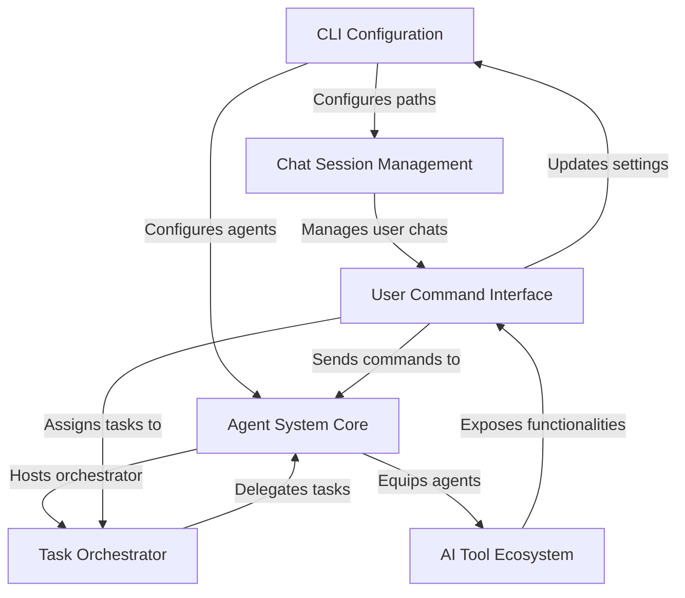

# Tutorial: agno-cli

The `agno-cli` project is a powerful *command-line interface* designed to interact with a
sophisticated *multi-agent AI system*. It allows users to **configure** core settings,
**manage ongoing chat sessions** with AI agents, and **orchestrate complex tasks** by
delegating them to specialized AI assistants. A rich **AI tool ecosystem** provides
agents with diverse functionalities to interact with the real world, all accessible
and controlled through a user-friendly **command interface**.

## Visual Overview

## Chapters

1. [User Command Interface](01_user_command_interface_.md)
2. [CLI Configuration](02_cli_configuration_.md)
3. [Agent System Core](03_agent_system_core_.md)
4. [Task Orchestrator](04_task_orchestrator_.md)
5. [Chat Session Management](05_chat_session_management_.md)
6. [AI Tool Ecosystem](06_ai_tool_ecosystem_.md)

---

Powered by  [agno-cli](https://github.com/paulgg-code/agno-cli).