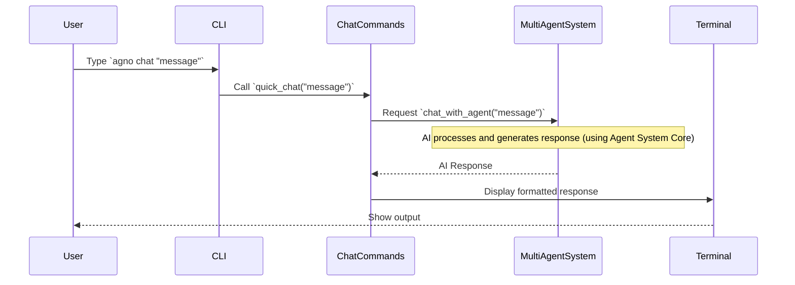

# Chapter 1: User Command Interface

Imagine you're the captain of a super-advanced spaceship, and that spaceship is your powerful new multi-agent AI system. How do you tell it what to do? You don't have a million buttons or a fancy touch screen. Instead, you have a sleek, efficient control panel where you type commands. This is exactly what the `agno-cli` **User Command Interface** is!

It's the main gateway for you to control the entire multi-agent AI system. It takes your typed commands, like `agno chat` or `agno files --list`, and translates them into clear instructions that your AI agents can understand. Then, it takes the AI's complex responses, formats them neatly with colors and tables, and displays them directly in your terminal, making powerful AI accessible and easy to use.

## What is the User Command Interface?

At its heart, the User Command Interface (often called a "Command Line Interface" or CLI) is how you interact with `agno-cli` by typing text commands into your terminal. Think of it as having a direct conversation with the AI system, rather than clicking buttons on a screen.

It solves a big problem: making a very sophisticated multi-agent AI system easy for a human to manage. Instead of needing to know complicated code, you just type simple, human-readable commands.

Here’s what it primarily does:

*   **Translates Your Wishes**: You type something like `agno chat "Hello, tell me about the weather."`. The User Command Interface understands "chat with an agent" and "the message is 'Hello, tell me about the weather.'". It then converts this into a digital instruction for the AI agents.
*   **Receives AI Responses**: When the AI agents process your request and come up with an answer, the User Command Interface is there to receive it.
*   **Makes AI Responses Readable**: AI responses can sometimes be very technical or complex. The User Command Interface takes these responses, adds colors, creates neat tables, and formats them so you can easily understand them right in your terminal window.

## Using the Agno CLI: Your First Commands

Let's dive into some practical examples to see how easy it is to start using the `agno-cli` interface.

First, you can always ask `agno` for help by typing:

```bash
agno --help
```

This command asks the User Command Interface to list all the main categories of commands available, like `chat`, `agents`, `team`, and `files`. It's your quick guide to what `agno` can do!

### Use Case: Listing Your Agents

Imagine you want to see which AI agents are currently available in your system, what their roles are, and their status. You'd use the `agents` command with the `--list` option:

```bash
agno agents --list
```

**What you'll see:** The User Command Interface will display a clear, colored table directly in your terminal showing all your agents, their unique IDs, names, roles, current status (like `idle` or `working`), and more. It organizes all that raw information into an easy-to-read format.

### Use Case: Having a Quick Chat with an Agent

Now, let's say you want to quickly ask one of your agents a question. You can use the `chat` command with the `--quick` option. You can even specify which agent to talk to using `--agent`.

```bash
agno chat --agent "ResearchAgent" --quick "What's the capital of France?"
```

**What you'll see:** The User Command Interface will send your message to the "ResearchAgent." The agent will process it, and then its answer (hopefully "Paris"!) will be formatted and displayed back to you in a clear, easy-to-read panel in your terminal.

## Behind the Scenes: How Your Commands Work

When you type a command into `agno-cli`, it's like sending an instruction to the central control of your AI spaceship. Let's trace what happens when you use a simple command like `agno chat --quick "Hello"`.

1.  **You Type**: You type `agno chat --quick "Hello"` into your terminal.
2.  **CLI Takes Charge**: The `agno-cli` program, which is the heart of the User Command Interface, immediately intercepts this command. It's built using a tool called `typer` that helps it understand your intentions based on the command and its options.
3.  **Command Dispatched**: The CLI knows that `chat` commands are handled by a specific part of the system, the `ChatCommands` component. It dispatches your request to it.
4.  **Request to AI Brain**: The `ChatCommands` component then takes your message and prepares it for the main brain of your AI system, the [Agent System Core](03_agent_system_core_.md). It asks an agent within the core to "chat" with your message.
5.  **AI Processes**: The [Agent System Core](03_agent_system_core_.md) then activates the chosen AI agent. The agent processes your message, perhaps uses some [AI Tool Ecosystem](06_ai_tool_ecosystem_.md) to get information, and formulates a response.
6.  **Response Back**: The AI agent's response travels back to the `ChatCommands` component.
7.  **Formatted Display**: Finally, the `ChatCommands` component uses special formatting tools (like `rich`) to add colors, panels, or tables to the AI's response, making it pretty and easy to read before showing it to you in your terminal.

Here's a simple diagram to visualize this flow:



## A Glimpse at the Code

Let's peek at how this is set up in the `agno-cli` code. Don't worry about understanding every line; the goal is just to see how these concepts connect to real programming.

The main `agno-cli` program in `agno_cli/cli.py` uses `typer` to define commands. When you type `agno chat`, this section of the code is activated:

```python
# File: agno_cli/cli.py
# ... (imports and initialization) ...

@app.command()
def chat(
    # ... (options like --agent, --quick) ...
):
    """Start an interactive chat session with an agent"""
    initialize_system() # Prepare the AI system
    
    # ... (logic to parse quick chat vs interactive) ...
    
    if quick:
        # Quick chat mode
        response = chat_commands.quick_chat(quick, agent, trace)
        console.print(Panel(Markdown(response), title="Response", border_style="blue"))
    else:
        # Interactive chat mode
        chat_commands.start_chat(
            agent_id=agent,
            agent_name=agent,
            trace=trace,
            metrics=metrics,
            context=context_dict
        )
```

This snippet shows how the `chat` command is set up. When you run `agno chat ...`, the code inside this function runs. Notice how it calls `initialize_system()` first to get everything ready, and then uses `chat_commands.quick_chat()` or `chat_commands.start_chat()` to do the actual work. This structure helps keep the code organized.

Next, let's look at `agno_cli/commands/chat_commands.py`, which contains the `ChatCommands` class. This is where the specific logic for handling chat conversations lives.

```python
# File: agno_cli/commands/chat_commands.py
# ... (imports) ...

class ChatCommands:
    def __init__(self, config, multi_agent_system, tracer, metrics):
        self.multi_agent_system = multi_agent_system # Connects to the AI core
        self.console = Console() # For rich formatting
        # ... (other initializations) ...
    
    def quick_chat(self, message: str, agent_id: str = None, 
                  trace: bool = False) -> str:
        """Send a single message and get response"""
        # ... (agent selection logic) ...
        
        try:
            # This is where the magic happens: asking the AI!
            response = self.multi_agent_system.chat_with_agent(
                selected_agent_id, 
                message
            )
            
            # ... (trace and metrics handling) ...
            
            return response
            
        except Exception as e:
            # ... (error handling) ...
            return f"Error: {str(e)}"
```

The `ChatCommands` class holds the `multi_agent_system` (which is your [Agent System Core](03_agent_system_core_.md)) and a `Console` object from the `rich` library. When `quick_chat` is called, it directly asks the `multi_agent_system` to `chat_with_agent()`. The `Console` object is used throughout the `ChatCommands` class (and others) to make sure the output looks great, using colors and special panels like the ones you saw in the examples.

## Why a Command Line Interface?

You might be wondering why `agno-cli` uses a text-based interface instead of a graphical one with buttons and menus. Here's a quick comparison:

| Feature      | Command Line Interface (CLI) | Graphical User Interface (GUI) |
| :----------- | :--------------------------- | :----------------------------- |
| **Speed**    | Very fast for experienced users (quick typing) | Slower, requires mouse/trackpad movements |
| **Automation** | Excellent for scripting and repeating tasks | Harder to automate complex sequences |
| **Precision**  | Direct control, specific parameters | Can be less precise, more visual clicks |
| **Resources**  | Minimal system resources | More resource-intensive (graphics) |
| **Accessibility** | Text-based, can be used remotely, good for screen readers | Visual, requires specific screen sizes |
| **Learning Curve** | Steeper initially, but powerful once mastered | Easier to learn for basic tasks |

For managing a complex AI system with many agents, tasks, and configurations, the power, precision, and automation capabilities of a CLI make it an ideal choice for `agno-cli`. It allows you to quickly assign complex tasks, monitor your agents, and review results with high efficiency.

## Conclusion

You've just been introduced to the very first layer of `agno-cli`: the User Command Interface. You now know that it's your direct communication channel with the powerful multi-agent AI system, translating your commands and formatting the AI's responses for easy understanding. You've also seen how simple it is to use basic commands like `agno agents --list` and `agno chat`, and gained a high-level understanding of what happens when you press Enter.

In the next chapter, we'll dive into how you can customize and manage your `agno-cli` experience by exploring the concept of [CLI Configuration](02_cli_configuration_.md). You'll learn how to set up `agno` to work just the way you want it!

---

<sub><sup>Powered by  [agno-cli](https://github.com/paulgg-code/agno-cli).</sup></sub> <sub><sup>**References**: [[1]](https://github.com/paulgg-code/agno-cli/blob/224671768634650c331417cb4eb63e65003c7507/agno_cli/cli.py), [[2]](https://github.com/paulgg-code/agno-cli/blob/224671768634650c331417cb4eb63e65003c7507/agno_cli/commands/__init__.py), [[3]](https://github.com/paulgg-code/agno-cli/blob/224671768634650c331417cb4eb63e65003c7507/agno_cli/commands/agent_commands.py), [[4]](https://github.com/paulgg-code/agno-cli/blob/224671768634650c331417cb4eb63e65003c7507/agno_cli/commands/chat_commands.py), [[5]](https://github.com/paulgg-code/agno-cli/blob/224671768634650c331417cb4eb63e65003c7507/agno_cli/commands/team_commands.py)</sup></sub>
