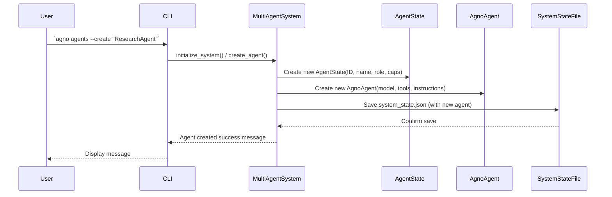

# Chapter 3: Agent System Core

In [Chapter 2: CLI Configuration](02_cli_configuration_.md), you mastered how to personalize your `agno-cli` experience, setting up everything from your preferred AI models to your API keys. Now that your command center is perfectly tuned, it’s time to meet the actual AI team members you'll be commanding!

Imagine you're not just flying a spaceship, but building and managing its highly specialized crew of AI robots. Each robot has a name, a job, and specific skills. How do you keep track of all of them? How do you know who's available for a new mission, or what tools a particular robot can use?

This is precisely what the `agno-cli` **Agent System Core** does! It's the foundational management layer for all your AI assistants. Think of it as the **Headquarters and HR department for your AI agents.** It's the central hub that registers, tracks, and manages every individual AI assistant (called an 'Agent') within your system.

## What is the Agent System Core?

At its heart, the Agent System Core is where all your AI personalities and capabilities come to life. It's not just about running an AI model; it's about giving that model an identity, a purpose, and a set of abilities.

It solves the problem of organizing a team of AI. Instead of having one generic AI, `agno-cli` allows you to have many, each designed for a specific purpose. The Agent System Core ensures that:

*   **Each AI has an Identity**: Every agent gets a unique ID and a name, making them distinct individuals.
*   **A Clear Role**: Agents are assigned specific roles like `Leader`, `Worker`, or `Specialist`, defining their primary responsibilities.
*   **Defined Capabilities**: Agents are equipped with specific tools (like a search engine or a file system tool) and skills (like analysis or planning), enabling them to perform particular tasks.
*   **Centralized Registry**: It acts as a directory, keeping track of all agents, their current status (idle, working, etc.), and their performance metrics.

## Key Concepts of the Agent System Core

Let's break down the core ideas that make up this crucial component:

### 1. Agents: Your AI Team Members

An "Agent" in `agno-cli` is an individual AI assistant. It's more than just a large language model (LLM); it's an LLM with a defined identity and purpose. Think of them as specialized employees in your digital company.

### 2. Roles: Defining Responsibilities

Every agent is assigned a `Role`. This helps the system (and you!) understand what kind of tasks an agent is best suited for.

*   **Leader**: Oversees projects, delegates tasks, and makes high-level decisions. (e.g., "ProjectManager")
*   **Worker**: Executes general tasks and follows instructions. (e.g., "CodeAssistant")
*   **Specialist**: Possesses deep expertise and specific tools in a particular domain. (e.g., "ResearchAgent", "FinancialAnalyst")
*   **Contributor**: Provides specific knowledge or output to tasks.
*   **Coordinator**: Manages communication and workflow between agents.
*   **Observer**: Monitors and reports on system activities.

### 3. Capabilities: What an Agent Can Do

Capabilities define an agent's abilities. They are categorized into:

*   **Tools**: Access to external functions or APIs (e.g., `duckduckgo_tools` for searching the web, `yfinance_tools` for financial data, `file_system_tools` for reading/writing files).
*   **Skills**: Abstract abilities that don't directly map to a tool (e.g., `research`, `analysis`, `planning`, `summarization`).
*   **Modalities**: What kind of data they can process or generate (e.g., `text`, `image`, `code`).
*   **Languages**: Which human languages they can communicate in.

These capabilities tell the Agent System Core which agent is the best fit for a given task.

## Use Case: Creating and Listing Your Agents

Let's put this into practice by creating a new AI agent and then listing all the agents in your system.

### Step 1: List Existing Agents

Before creating a new one, let's see who's already on your team. You use the `agno agents` command with the `--list` option:

```bash
agno agents --list
```

**What you'll see:** You'll likely see a default "TeamLeader" agent, or perhaps others if you've already created them. The output will be a clear table showing each agent's ID, Name, Role, Status, Workload, and Capabilities.

```
┌─────────────────────────────────────── Agents ───────────────────────────────────────┐
│ ID       │ Name        │ Role     │ Status   │ Workload │ Success Rate │ Capabilities                 │
├──────────┼─────────────┼──────────┼──────────┼──────────┼──────────────┼──────────────────────────────┤
│ 8e1c6b2b │ TeamLeader  │ leader   │ idle     │ 0.0%     │ 100.0%       │ Tools: reasoning_tools,      │
│          │             │          │          │          │              │ yfinance_tools; Skills:      │
│          │             │          │          │              │ coordination, planning,      │
│          │             │          │              │ decision_making              │
└──────────┴─────────────┴──────────┴──────────┴──────────┴──────────────┴──────────────────────────────┘
```

### Step 2: Create a New Agent

Now, let's create a "ResearchAgent" who is a specialist in gathering information using web search and academic papers.

```bash
agno agents --create "ResearchAgent" --role specialist --description "Agent specializing in research and information retrieval" --capabilities '{"tools": ["duckduckgo_tools", "arxiv_tools", "wikipedia_tools"], "skills": ["research", "summarization", "information_gathering"]}'
```

**What you'll see:**

```bash
[green]Created agent 'ResearchAgent' with ID: 4f7d2e3c-a9b1-4c0f-9d8e-1f2g3h4i5j6k[/green]
```

(The ID will be a unique long string, shown here truncated for readability.)

You've just "hired" a new AI team member!

### Step 3: Verify the New Agent

Run the `list` command again to see your new agent:

```bash
agno agents --list
```

**What you'll see:** Your `ResearchAgent` will now appear in the list, showing its role, current `idle` status, and the tools and skills you assigned.

```
┌─────────────────────────────────────── Agents ───────────────────────────────────────┐
│ ID       │ Name          │ Role        │ Status   │ Workload │ Success Rate │ Capabilities                 │
├──────────┼───────────────┼─────────────┼──────────┼──────────┼──────────────┼──────────────────────────────┤
│ 8e1c6b2b │ TeamLeader    │ leader      │ idle     │ 0.0%     │ 100.0%       │ Tools: reasoning_tools,      │
│          │               │             │          │          │              │ yfinance_tools; Skills: ...  │
│ 4f7d2e3c │ ResearchAgent │ specialist  │ idle     │ 0.0%     │ 0.0%         │ Tools: duckduckgo_tools,     │
│          │               │             │          │          │              │ arxiv_tools, wikipedia_tools;│
│          │               │             │          │          │              │ Skills: research,            │
│          │               │             │          │              │ summarization,               │
│          │               │             │          │              │ information_gathering        │
└──────────┴───────────────┴─────────────┴──────────┴──────────┴──────────────┴──────────────────────────────┘
```

You can now chat with this specific agent using `agno chat --agent "ResearchAgent" --quick "Tell me about the latest AI research on arXiv."`

## Behind the Scenes: How Agents Come to Life

When you run `agno agents --create`, a sophisticated process unfolds to bring your AI agent into existence. Let's trace the journey:

1.  **Command Reception**: The [User Command Interface](01_user_command_interface_.md) (the `agno-cli` program) intercepts your `agno agents --create` command.
2.  **System Initialization**: The `initialize_system()` function is called. This function ensures that the `MultiAgentSystem` (your Agent System Core) is ready. If it's the first time running, it creates a new system; otherwise, it loads the saved state of your agents and their configuration from a file (`~/.agno_cli/system_state.json`). This is how `agno-cli` remembers your agents across sessions!
3.  **Agent Creation Request**: The `agents` command handler (in `agno_cli/cli.py`) calls the `create_agent` method on the `multi_agent_system` object, passing the name, role, description, and capabilities you provided.
4.  **Agent State Definition**: Inside `MultiAgentSystem.create_agent`, two key things happen:
    *   An `AgentState` object (from `agno_cli/agents/agent_state.py`) is created. This object holds all the metadata about your agent: its ID, name, role, current status, goals, and capabilities. It's like the agent's digital resume and activity log.
    *   An actual `agno.Agent` object (the intelligent "brain" from the underlying `agno` framework) is instantiated. This `agno.Agent` is given an AI model (based on your [CLI Configuration](02_cli_configuration_.md)) and the specific tools linked to the capabilities you defined (e.g., `duckduckgo_tools`, `arxiv_tools`).
5.  **Registration and Persistence**: The `AgentSystemCore` stores both the `AgentState` and the `agno.Agent` in its internal registries. Crucially, it then saves the updated system state, including your new agent, to the `~/.agno_cli/system_state.json` file.
6.  **Confirmation**: Finally, a success message is displayed back to you in the terminal.

Here's a simplified sequence of what happens:



## A Glimpse at the Code

Let's peek into the actual code that makes this work. Don't worry about understanding every line; the goal is just to see how these concepts connect to real programming.

### 1. The `agents` Command in `agno_cli/cli.py`

This is where your `agno agents` commands are handled. Notice how it calls `initialize_system()` first, and then interacts with `multi_agent_system` to `create_agent` or `list_agents`.

```python
# File: agno_cli/cli.py

# ... (imports and global initializations) ...

def initialize_system():
    """Initialize the multi-agent system and tools"""
    global multi_agent_system, config # Make sure these are accessible
    
    if config is None:
        config = Config() # Load CLI configuration
    
    if multi_agent_system is None:
        # Load existing system state or create new
        system_state_file = Path.home() / '.agno_cli' / 'system_state.json'
        if system_state_file.exists():
            multi_agent_system = MultiAgentSystem.load_system_state(system_state_file, config)
        else:
            multi_agent_system = MultiAgentSystem(config)

@app.command()
def agents(
    list_agents: bool = typer.Option(False, "--list", "-l", help="List all agents"),
    create: Optional[str] = typer.Option(None, "--create", help="Create new agent with name"),
    role: Optional[str] = typer.Option("worker", "--role", help="Agent role"),
    description: Optional[str] = typer.Option("", "--description", help="Agent description"),
    capabilities: Optional[str] = typer.Option(None, "--capabilities", help="JSON capabilities for new agent")
):
    """Manage agents in the multi-agent system"""
    initialize_system() # Ensure the system is ready
    
    # AGENT STATE PERSISTENCE PATCH START - (loads state if it wasn't loaded by initialize_system)
    AGENT_STATE_PATH = Path.home() / '.agno_cli' / 'system_state.json'
    if AGENT_STATE_PATH.exists():
        try:
            loaded_system = MultiAgentSystem.load_system_state(AGENT_STATE_PATH, config)
            global multi_agent_system # Update the global instance
            multi_agent_system = loaded_system
        except Exception as e:
            console.print(f"[red]Failed to load agent state: {e}[/red]")
    # AGENT STATE PERSISTENCE PATCH END

    if list_agents:
        agents = multi_agent_system.list_agents() # Ask the core for agents
        # ... (formatting and printing table logic) ...
        
    elif create:
        try:
            agent_role = AgentRole(role.lower())
            caps = {}
            if capabilities:
                caps = json.loads(capabilities) # Parse JSON capabilities
            
            agent_id = multi_agent_system.create_agent( # Tell the core to create agent
                name=create,
                role=agent_role,
                description=description,
                capabilities=caps
            )
            console.print(f"[green]Created agent '{create}' with ID: {agent_id}[/green]")
            # Save state after creating for persistence
            try:
                multi_agent_system.save_system_state(AGENT_STATE_PATH)
            except Exception as e:
                console.print(f"[red]Failed to save agent state: {e}[/red]")
        except ValueError as e:
            console.print(f"[red]Error creating agent: {e}[/red]")
        except json.JSONDecodeError:
            console.print("[red]Invalid JSON capabilities[/red]")
    # ... (other agent commands like remove, status) ...
```

### 2. The `MultiAgentSystem` in `agno_cli/agents/multi_agent.py`

This class is the "Agent System Core" itself. It manages the collection of `AgentState` objects and `agno.Agent` instances.

```python
# File: agno_cli/agents/multi_agent.py

import uuid
from typing import Dict, List, Any, Optional, Union
from pathlib import Path

from agno.agent import Agent # The actual AI agent from Agno framework
from agno.models.anthropic import Claude # Example AI models
from agno.models.openai import OpenAIChat

from .agent_state import AgentState, AgentRole, AgentStatus # Our agent metadata

class MultiAgentSystem:
    def __init__(self, config: Config, system_id: str = None):
        self.config = config # Link to CLI configuration
        self.system_id = system_id or str(uuid.uuid4())
        self.agno_agents: Dict[str, Agent] = {}  # Stores the actual Agno AI agents
        self.agent_states: Dict[str, AgentState] = {}  # Stores metadata about agents
        # ... (other initializations) ...
        self._create_default_leader() # Always start with a leader

    def create_agent(self, name: str, role: AgentRole, description: str = "",
                    capabilities: Dict[str, List[str]] = None,
                    model_override: str = None) -> str:
        """Create a new agent in the system"""
        agent_id = str(uuid.uuid4()) # Generate unique ID
        
        agent_state = AgentState(agent_id, name, role, description) # Create metadata
        if capabilities:
            for cap_type, cap_list in capabilities.items():
                for capability in cap_list:
                    agent_state.add_capability(cap_type, capability) # Add capabilities

        model = self._get_model_for_agent(model_override) # Get AI model from config
        tools = self._get_tools_for_agent(agent_state)   # Get tools based on capabilities
        
        # Instantiate the actual Agno AI agent
        agno_agent = Agent(
            name=name,
            role=role.value,
            description=description,
            model=model,
            tools=tools,
            # ... (other configs) ...
            session_id=agent_id
        )
        
        self.agno_agents[agent_id] = agno_agent   # Store the AI brain
        self.agent_states[agent_id] = agent_state # Store the metadata
        # ... (register with orchestrator) ...
        return agent_id
    
    def _get_model_for_agent(self, model_override: str = None) -> Union[Claude, OpenAIChat]:
        """Helper to get the AI model instance (e.g., Claude or OpenAI)"""
        model_id = model_override or self.config.model.model_id
        api_key = self.config.get_api_key()
        # ... (logic to create Claude or OpenAIChat based on config) ...
        
    def _get_tools_for_agent(self, agent_state: AgentState) -> List:
        """Helper to get tool instances based on agent's capabilities"""
        tools = []
        if agent_state.has_tool("reasoning_tools"):
            from agno.tools.reasoning import ReasoningTools
            tools.append(ReasoningTools(add_instructions=True))
        if agent_state.has_tool("yfinance_tools"):
            from agno.tools.yfinance import YFinanceTools
            tools.append(YFinanceTools())
        # ... (many other tools like search, file_system_tools, etc. are added here) ...
        return tools

    def list_agents(self) -> List[Dict[str, Any]]:
        """List all agents and their states"""
        agents = []
        for agent_id, agent_state in self.agent_states.items():
            agents.append({
                "agent_id": agent_id,
                "name": agent_state.name,
                "role": agent_state.role.value,
                "status": agent_state.status.value,
                # ... (other state details from agent_state) ...
                "capabilities": agent_state.capabilities.to_dict(),
            })
        return agents
    
    def save_system_state(self, file_path: Path) -> None:
        """Save the entire system state for persistence"""
        # ... (logic to serialize agent_states and orchestrator state to JSON) ...

    @classmethod
    def load_system_state(cls, file_path: Path, config: Config) -> 'MultiAgentSystem':
        """Load system state from files"""
        # ... (logic to deserialize agent_states and orchestrator state from JSON) ...
```

### 3. `AgentState` in `agno_cli/agents/agent_state.py`

This class defines the structure for holding all the current information about a specific agent.

```python
# File: agno_cli/agents/agent_state.py

import json
from datetime import datetime
from enum import Enum
from typing import Dict, List, Any, Optional, Set
from dataclasses import dataclass, field

class AgentRole(Enum): # Defines agent roles
    LEADER = "leader"
    WORKER = "worker"
    SPECIALIST = "specialist"
    # ... (other roles) ...

class AgentStatus(Enum): # Defines agent status
    IDLE = "idle"
    WORKING = "working"
    WAITING = "waiting"
    # ... (other statuses) ...

@dataclass
class AgentCapabilities: # Holds what an agent can do
    tools: Set[str] = field(default_factory=set)
    skills: Set[str] = field(default_factory=set)
    languages: Set[str] = field(default_factory=set)
    modalities: Set[str] = field(default_factory=set)
    max_concurrent_tasks: int = 1

    def to_dict(self) -> Dict[str, Any]: # For saving to file
        return {
            'tools': list(self.tools), 'skills': list(self.skills),
            'languages': list(self.languages), 'modalities': list(self.modalities),
            'max_concurrent_tasks': self.max_concurrent_tasks
        }
    # ... (from_dict for loading) ...

class AgentState: # The main class for an agent's metadata
    def __init__(self, agent_id: str, name: str, role: AgentRole, description: str = ""):
        self.agent_id = agent_id
        self.name = name
        self.role = role
        self.description = description
        self.status = AgentStatus.IDLE # Initial status
        self.created_at = datetime.now()
        self.updated_at = datetime.now()
        self.current_goals: List[str] = []
        self.capabilities = AgentCapabilities() # Link to capabilities
        self.current_tasks: List[str] = []
        # ... (metrics, history, etc.) ...
    
    def update_status(self, status: AgentStatus) -> None:
        self.status = status
        self.updated_at = datetime.now()
        # ... (update metrics) ...
        
    def add_capability(self, capability_type: str, capability: str) -> None:
        """Add a capability (tool, skill, etc.) to the agent"""
        if capability_type in ["tool", "tools"]:
            self.capabilities.tools.add(capability)
        # ... (for skills, languages, modalities) ...

    def to_dict(self) -> Dict[str, Any]: # For saving agent state
        return {
            'agent_id': self.agent_id, 'name': self.name, 'role': self.role.value,
            'status': self.status.value, 'created_at': self.created_at.isoformat(),
            'capabilities': self.capabilities.to_dict(),
            # ... (other fields) ...
        }
    # ... (from_dict for loading) ...

```

## Why a Centralized Agent System Core?

This structured approach to managing AI agents offers significant advantages:

| Feature              | Agent System Core Approach                           | Ad-hoc / Individual AI Approach                               |
| :------------------- | :--------------------------------------------------- | :------------------------------------------------------------ |
| **Organization**     | Central registry of all agents, roles, and states.  | Dispersed, hard to track all active AIs and their purposes.    |
| **Scalability**      | Easy to add or remove agents, define new roles.       | Adding new AIs requires significant manual setup each time. |
| **Role Clarity**     | Agents have defined roles (Leader, Specialist).      | AIs might overlap in function or lack clear responsibilities. |
| **Capability Matching**| System can intelligently assign tasks to best-suited agents. | Manual selection of the right AI for a task can be difficult. |
| **Persistence**      | Agent definitions and states are saved and loaded.   | AI configurations and current 'knowledge' might be lost.       |
| **Monitoring**       | Easier to track agent status, workload, and performance. | Difficult to get an overview of overall AI system health.      |

For building a robust and expandable multi-agent AI system like `agno-cli`, the Agent System Core is indispensable. It provides the foundation for collaboration, delegation, and efficient management of your entire AI team.

## Conclusion

You've just uncovered the heart of `agno-cli`: the Agent System Core. You now understand that it's the central management layer for all your AI assistants, defining their unique identities, roles, and capabilities. You've learned how to easily create and list agents, and gained insight into how `agno-cli` organizes and remembers your AI team behind the scenes.

With your AI agents now defined and ready, the next step is to make them work together! In the next chapter, we'll explore the [Task Orchestrator](04_task_orchestrator_.md), which is responsible for assigning tasks, coordinating agent activities, and enabling seamless teamwork among your AI crew.

---

<sub><sup>Powered by [agno-cli](https://github.com/paulgg-code/agno-cli).</sup></sub> <sub><sup>**References**: [[1]](https://github.com/paulgg-code/agno-cli/blob/224671768634650c331417cb4eb63e65003c7507/agno_cli/agents/__init__.py), [[2]](https://github.com/paulgg-code/agno-cli/blob/224671768634650c331417cb4eb63e65003c7507/agno_cli/agents/agent_state.py), [[3]](https://github.com/paulgg-code/agno-cli/blob/224671768634650c331417cb4eb63e65003c7507/agno_cli/agents/multi_agent.py), [[4]](https://github.com/paulgg-code/agno-cli/blob/224671768634650c331417cb4eb63e65003c7507/agno_cli/cli.py)</sup></sub>