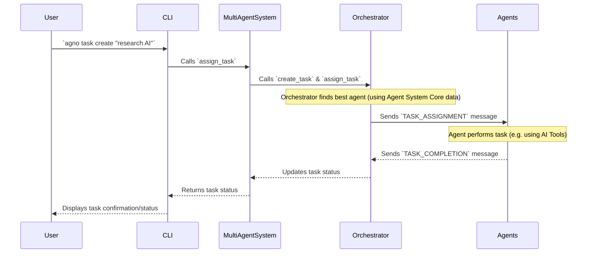

# Chapter 4: Task Orchestrator

In [Chapter 3: Agent System Core](03_agent_system_core_.md), you learned how to define and manage your individual AI team members – your Agents – giving them unique identities, roles, and capabilities. You've got your specialized crew ready, from the `TeamLeader` to the `ResearchAgent`. But what happens when you give them a big, complex mission that requires multiple steps or even multiple agents working together?

Imagine you're leading a highly skilled team on an important project. You don't just shout orders into the void and hope someone picks them up. Instead, you need a **project manager** who can:

*   Break down the big project into smaller, manageable tasks.
*   Figure out which team member is best suited for each sub-task based on their skills and availability.
*   Delegate those tasks clearly.
*   Ensure team members communicate and share their progress.
*   Keep track of the overall project's status.

This is *exactly* what the `agno-cli` **Task Orchestrator** does for your AI agents! It's the central brain that manages how agents collaborate to achieve a goal.

## What is the Task Orchestrator?

At its core, the Task Orchestrator is the **project manager for your team of AI assistants**. When you give `agno-cli` a complex request that can't be handled by a single simple command, this component steps in. It's responsible for making sure your AI team works together efficiently, sharing information and tracking progress toward the overall objective.

It solves a crucial problem: how to transform a high-level goal into actionable steps that individual, specialized AI agents can execute, and then coordinate their efforts.

Here's what it primarily does:

*   **Task Definition & Management**: It defines what a "task" is, stores all tasks, and tracks their status (pending, assigned, completed).
*   **Intelligent Delegation**: It decides which of your agents (like the `ResearchAgent` or `TeamLeader`) is the best fit for a particular task based on their roles, capabilities, and current workload.
*   **Inter-Agent Communication**: It acts as a central hub for agents to send messages to each other, such as "Task assigned!" or "Here's my result."
*   **Progress Tracking**: It monitors how tasks are progressing and keeps an overall view of the project's health.

## Key Concepts of the Task Orchestrator

Let's look at the foundational ideas behind this intelligent project manager:

### 1. Tasks: The Missions for Your Agents

A "Task" is a defined piece of work that needs to be done. It has a description (what to do), requirements (what skills or tools are needed), and a priority. The Orchestrator creates and manages these tasks.

### 2. Agent Matching & Delegation

This is where the magic happens! When a new task comes in, the Orchestrator doesn't just pick any agent. It intelligently:
*   Looks at the task's requirements (e.g., "needs `duckduckgo_tools`" or "requires `research` skill").
*   Checks the capabilities of all available agents (from the [Agent System Core](03_agent_system_core_.md)).
*   Considers their current workload.
*   Selects the *best* agent for the job and officially assigns the task.

### 3. Inter-Agent Communication

Agents need to talk to each other! The Orchestrator provides a structured way for messages to be sent, received, and processed. This includes:
*   **Task Assignment Messages**: Orchestrator tells an agent "You've got a new task!"
*   **Task Completion Messages**: Agents tell the Orchestrator "I finished my part!"
*   **Information Sharing**: Agents share findings or data with the team.
*   **Help Requests**: Agents can ask the Orchestrator to find another agent to assist them.

### 4. Workflow Management

The Orchestrator ensures that tasks are handled in the correct order, especially if one task depends on another. It helps prevent agents from being stuck or doing redundant work.

## Use Case: Delegating a Complex Research Task

Let's say you want your AI team to "Research the impact of quantum computing on cybersecurity by year 2030." This is more than a simple chat; it requires gathering information, likely from the internet, and then summarizing it. The Task Orchestrator is perfect for this!

### Step 1: Create the Task

You'll use the `agno task create` command. This tells the Task Orchestrator (via the [User Command Interface](01_user_command_interface_.md) and [Agent System Core](03_agent_system_core_.md)) that you have a new mission for the team.

```bash
agno task create "Research the impact of quantum computing on cybersecurity by year 2030. Provide a 500-word summary and key takeaways." --priority high
```

**What happens:** The `agno-cli` will confirm that the task has been created and will automatically start the process of assigning it. You won't see an immediate answer because the AI agents are now working behind the scenes!

```
[green]Created task with ID: a1b2c3d4-e5f6-7890-1234-567890abcdef[/green]
[green]Task 'Research the impact of quantum computing on cybersecurity by year 2030. Provide a 500-word summary and key takeaways.' assigned to TeamLeader (or ResearchAgent, depending on setup)[/green]
```

The specific agent that gets assigned will depend on your existing agents and their defined capabilities. The `TeamLeader` often acts as a starting point if no other agent is explicitly requested or found suitable for the initial breakdown.

### Step 2: Monitor Task Progress

While the agents are busy, you can ask the Orchestrator for updates on all active tasks:

```bash
agno task --list
```

**What you'll see:** The `agno-cli` will display a table showing the status of your tasks. You might see your research task moving from `pending` to `assigned` or even `completed` once the agents finish their work.

```
┌──────────────────────────────────────── Tasks ────────────────────────────────────────┐
│ ID       │ Description                                    │ Status   │ Assigned To  │ Priority │
├──────────┼────────────────────────────────────────────────┼──────────┼──────────────┼──────────┤
│ a1b2c3d4 │ Research the impact of quantum computing...    │ active   │ TeamLeader   │ HIGH     │
└──────────┴────────────────────────────────────────────────┴──────────┴──────────────┴──────────┘
```

When the task is eventually `completed`, you might see:

```
┌──────────────────────────────────────── Tasks ────────────────────────────────────────┐
│ ID       │ Description                                    │ Status     │ Assigned To  │ Priority │
├──────────┼────────────────────────────────────────────────┼────────────┼──────────────┼──────────┤
│ a1b2c3d4 │ Research the impact of quantum computing...    │ completed  │ TeamLeader   │ HIGH     │
└──────────┴────────────────────────────────────────────────┴────────────┴──────────────┴──────────┘
```

And the system might even provide a summary of the result if the task completed successfully and the orchestrator received it.

## Behind the Scenes: How the Orchestrator Works Its Magic

When you type `agno task create`, it's like dispatching a new mission brief to your AI project manager. Let's trace the flow:

1.  **You Issue Command**: You type `agno task create "..."` into your terminal.
2.  **CLI Intercepts**: The [User Command Interface](01_user_command_interface_.md) (`agno-cli`) receives your command.
3.  **System Preparation**: The `initialize_system()` function ensures that the `MultiAgentSystem` (your [Agent System Core](03_agent_system_core_.md)) and its integrated `AgentOrchestrator` are loaded and ready.
4.  **Task Creation Request**: The `task` command handler within `agno-cli` calls the `assign_task` method on the `multi_agent_system` object, passing your task description and requirements.
5.  **Orchestrator Takes Over**: The `multi_agent_system` hands off the task request to its internal `AgentOrchestrator`.
6.  **Task Recording**: The `AgentOrchestrator` creates a new `Task` object, assigns it a unique ID, and adds it to its list of pending tasks.
7.  **Agent Selection**: The `AgentOrchestrator` now evaluates all available agents (using the information from the [Agent System Core](03_agent_system_core_.md)), comparing their capabilities (tools, skills) and current workload against the task's requirements. It intelligently picks the most suitable agent.
8.  **Task Assignment Message**: Once an agent is chosen, the `AgentOrchestrator` updates the `Task` status to "assigned" and sends a special `TASK_ASSIGNMENT` message to the selected agent. This message tells the agent what to do.
9.  **Agent Execution**: The assigned agent receives the message, begins working on the task (e.g., performing web searches, processing data), potentially using its [AI Tool Ecosystem](06_ai_tool_ecosystem_.md).
10. **Progress Reporting**: As the agent works, or when it completes the task, it sends `STATUS_UPDATE` or `TASK_COMPLETION` messages back to the `AgentOrchestrator`.
11. **Orchestrator Updates**: The `AgentOrchestrator` processes these messages, updates the task's status, records results, and makes the information available if you query `agno task --list`.

Here's a simple diagram to visualize this process:



## A Glimpse at the Code

Let's peek at how this is set up in the `agno-cli` code. Don't worry about understanding every line; the goal is just to see how these concepts connect to real programming.

### 1. The `Task` Definition in `agno_cli/agents/orchestrator.py`

This `dataclass` simply defines the structure of a `Task` object, holding its ID, description, requirements, and status.

```python
# File: agno_cli/agents/orchestrator.py

import uuid
from datetime import datetime
from typing import Dict, List, Any, Optional
from dataclasses import dataclass
from enum import Enum

class TaskPriority(Enum):
    LOW = 1
    NORMAL = 2
    HIGH = 3
    URGENT = 4
    CRITICAL = 5

@dataclass
class Task:
    """Task definition for agents"""
    task_id: str
    description: str
    requirements: Dict[str, Any]
    priority: TaskPriority
    assigned_agent: Optional[str] = None
    created_at: datetime = None
    status: str = "pending" # pending, assigned, completed, failed
    # ... (other fields) ...
    
    def __post_init__(self):
        if self.created_at is None:
            self.created_at = datetime.now()
    
    # ... (to_dict and from_dict methods for saving/loading) ...
```
This simple structure allows the Orchestrator to keep track of every detail about a mission, including its current state.

### 2. The `AgentOrchestrator` Class in `agno_cli/agents/orchestrator.py`

This class is the heart of the Task Orchestrator. It contains the logic for managing tasks, assigning them, and handling messages.

```python
# File: agno_cli/agents/orchestrator.py

# ... (imports) ...
from .agent_state import AgentState, AgentRole, AgentStatus # Used for agent data

class AgentOrchestrator:
    """Orchestrates multiple agents for collaborative task execution"""
    
    def __init__(self, orchestrator_id: str = None):
        self.orchestrator_id = orchestrator_id or str(uuid.uuid4())
        self.agents: Dict[str, AgentState] = {} # Registered agents (metadata from Agent System Core)
        self.tasks: Dict[str, Task] = {}       # All tasks managed by this orchestrator
        self.message_queue: List[AgentMessage] = [] # Queue for inter-agent messages
        # ... (other initializations like message handlers, context) ...
    
    def create_task(self, description: str, requirements: Dict[str, Any] = None, 
                   priority: TaskPriority = TaskPriority.NORMAL, auto_assign: bool = False) -> str:
        """Create a new task"""
        task_id = str(uuid.uuid4())
        task = Task(
            task_id=task_id,
            description=description,
            requirements=requirements or {},
            priority=priority
        )
        self.tasks[task_id] = task
        
        if auto_assign:
            self.assign_task(task_id) # Immediately try to assign
        
        return task_id

    def assign_task(self, task_id: str, preferred_agent: str = None) -> bool:
        """Assign a task to an appropriate agent"""
        task = self.tasks.get(task_id)
        if not task: return False
        
        best_agent = self._find_best_agent_for_task(task) # Finds the right agent!
        if best_agent:
            return self._assign_task_to_agent(task, best_agent)
        return False
        
    def _find_best_agent_for_task(self, task: Task) -> Optional[AgentState]:
        """Find the best agent for a given task based on capabilities and workload"""
        available_agents = [agent for agent in self.agents.values() if agent.is_available()]
        
        # This function scores agents based on how well they meet task requirements
        # and their current workload. It ensures the task goes to the most capable
        # and available agent.
        
        # ... (logic to iterate through agents, check capabilities, calculate score) ...
        
        return best_agent_found # Returns the AgentState of the chosen agent
    
    def _assign_task_to_agent(self, task: Task, agent: AgentState) -> bool:
        """Assign a specific task to a specific agent"""
        task.assigned_agent = agent.agent_id
        task.status = "assigned"
        agent.add_task(task.task_id, task.description) # Update agent's internal state
        
        # Send a formal task assignment message to the agent
        self.send_message(
            from_agent="orchestrator",
            to_agent=agent.agent_id,
            message_type=MessageType.TASK_ASSIGNMENT,
            content=f"New task assigned: {task.description}",
            data={"task_id": task.task_id}
        )
        return True
    
    def send_message(self, from_agent: str, to_agent: str, message_type: MessageType,
                    content: str, data: Dict[str, Any] = None) -> str:
        """Send a message between agents (or orchestrator and agent)"""
        message_id = str(uuid.uuid4())
        message = AgentMessage(
            message_id=message_id, from_agent=from_agent, to_agent=to_agent,
            message_type=message_type, content=content, data=data or {},
            timestamp=datetime.now()
        )
        
        self.message_queue.append(message)      # Add to queue
        self.communication_log.append(message) # Record for history
        self._process_message(message)         # Process it immediately
        return message_id
    
    # ... (methods for handling completed tasks, processing messages etc.) ...
```

This code shows how the `AgentOrchestrator` keeps track of tasks and agents. When `create_task` is called, it registers the task and then (if `auto_assign` is true) immediately calls `assign_task`. The `assign_task` method is where the intelligent decision-making happens using `_find_best_agent_for_task` to pick the right AI for the job. Finally, `_assign_task_to_agent` formally assigns it and uses `send_message` to communicate the new task to the chosen agent.

### 3. Integration in `MultiAgentSystem` (`agno_cli/agents/multi_agent.py`)

The `MultiAgentSystem` (your [Agent System Core](03_agent_system_core_.md)) is responsible for creating and holding an instance of the `AgentOrchestrator`, and for delegating task-related commands to it.

```python
# File: agno_cli/agents/multi_agent.py

# ... (imports) ...
from .orchestrator import AgentOrchestrator, TaskPriority, MessageType # Our orchestrator

class MultiAgentSystem:
    """Multi-agent system that manages multiple Agno agents"""
    
    def __init__(self, config: Config, system_id: str = None):
        self.config = config
        self.system_id = system_id or str(uuid.uuid4())
        self.orchestrator = AgentOrchestrator(f"orchestrator_{self.system_id}") # Instantiate orchestrator!
        self.agno_agents: Dict[str, Agent] = {}  # Actual Agno agents (brains)
        self.agent_states: Dict[str, AgentState] = {}  # Agent state tracking (metadata)
        # ... (other initializations) ...
        self._create_default_leader() # Ensures a leader is always present

    def create_agent(self, name: str, role: AgentRole, description: str = "",
                    capabilities: Dict[str, List[str]] = None, model_override: str = None) -> str:
        # ... (logic to create agent_state and agno_agent) ...
        
        # Register the new agent with the orchestrator!
        self.orchestrator.register_agent(agent_state) 
        
        return agent_id
    
    def assign_task(self, description: str, requirements: Dict[str, Any] = None,
                   priority: TaskPriority = TaskPriority.NORMAL, preferred_agent: str = None) -> str:
        """Assign a task to the multi-agent system (delegates to orchestrator)"""
        task_id = self.orchestrator.create_task( # The orchestrator creates the task
            description=description,
            requirements=requirements,
            priority=priority,
            auto_assign=True  # Tell orchestrator to automatically assign
        )
        
        # If a preferred agent was specified, the orchestrator will try to use them first.
        if preferred_agent:
            self.orchestrator.assign_task(task_id, preferred_agent)
            
        return task_id
    
    # ... (methods for chatting, executing tasks, saving/loading state) ...
```

This snippet shows that the `MultiAgentSystem` *contains* the `AgentOrchestrator`. When you create an agent, it's immediately "registered" with the orchestrator so it knows about all available team members. And crucially, when you use `assign_task`, the `MultiAgentSystem` passes the request directly to its `orchestrator` to handle the complex delegation process.

## Why a Task Orchestrator?

Without a Task Orchestrator, managing multiple AI agents for complex goals would be a nightmare. Here’s a quick comparison of what it enables:

| Feature           | With Task Orchestrator (`agno-cli`)              | Without a Task Orchestrator (Manual)                       |
| :---------------- | :----------------------------------------------- | :--------------------------------------------------------- |
| **Complexity**    | Handles multi-step, multi-agent tasks automatically | User must manually break down tasks and assign to individual AIs |
| **Efficiency**    | Delegates to best-suited, available agents      | Requires user to know all agents' skills and availability |
| **Coordination**  | Manages inter-agent communication, dependencies | No built-in way for AIs to talk or collaborate             |
| **Scalability**   | Easy to add more agents, orchestrator adapts    | Adding more AIs increases manual management burden        |
| **Transparency**  | Provides clear task status and team overview    | Difficult to track progress across multiple AI interactions |
| **Resilience**    | Can reassign tasks if an agent fails/is removed | Failure of one AI might halt the entire process          |

For building powerful, collaborative AI systems, a Task Orchestrator is indispensable. It transforms a collection of individual AI agents into a cohesive, goal-oriented team.

## Conclusion

You've just been introduced to the project manager of your AI team: the Task Orchestrator! You now understand that this vital component is responsible for intelligently breaking down and delegating complex tasks, coordinating communication between your AI agents, and tracking overall progress. You've seen how a simple command like `agno task create` unleashes the power of orchestration, allowing your AI team to work together seamlessly.

Now that your agents can work together on complex tasks, the next step is to manage your ongoing conversations with them. In the next chapter, we'll dive into [Chat Session Management](05_chat_session_management_.md), learning how `agno-cli` keeps track of your dialogues with your AI team.

---

<sub><sup>Powered by [agno-cli](https://github.com/paulgg-code/agno-cli).</sup></sub> <sub><sup>**References**: [[1]](https://github.com/paulgg-code/agno-cli/blob/224671768634650c331417cb4eb63e65003c7507/agno_cli/agents/multi_agent.py), [[2]](https://github.com/paulgg-code/agno-cli/blob/224671768634650c331417cb4eb63e65003c7507/agno_cli/agents/orchestrator.py)</sup></sub>