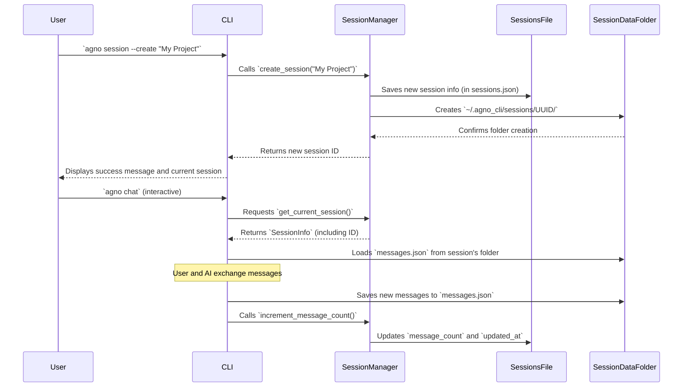

# Chapter 5: Chat Session Management

In [Chapter 4: Task Orchestrator](04_task_orchestrator_.md), you learned how `agno-cli` helps your AI agents work together on big projects, breaking down tasks and delegating them. That's great for complex missions! But what about your day-to-day conversations with the AI?

Imagine you're chatting with a friend. You don't start every sentence by re-explaining everything you've talked about for the last hour, right? Your friend remembers the context, the previous questions, and your ongoing discussion. Without this "memory," every interaction would feel like the very first one, constantly re-introducing topics and wasting time.

This is exactly what the `agno-cli` **Chat Session Management** system does for your conversations with the AI! It's like the CLI's personal memory for your chats. Instead of starting fresh every time you type a `chat` command, this system keeps track of your ongoing discussions. It assigns unique IDs to each conversation, remembers how many messages have been exchanged, and saves the session's context. This allows you to switch between different discussions or pick up where you left off, providing a continuous and personalized interaction experience with the AI.

## What is Chat Session Management?

At its heart, Chat Session Management is about giving your interactions with `agno-cli` a memory. It allows for natural, continuous conversations with your AI agents, just like talking to a human.

It solves the problem of "stateless" conversations – where the AI forgets everything you just said the moment its response is sent. By managing sessions, `agno-cli` ensures:

*   **Continuity**: You can pick up a conversation exactly where you left off, even days later.
*   **Context**: The AI remembers the flow of the discussion, previous questions, and its own answers.
*   **Organization**: You can have multiple, separate conversations (sessions) on different topics and easily switch between them without mixing up contexts.

## Key Concepts of Chat Session Management

Let's look at the core ideas that make this memory system work:

### 1. Sessions: Your Conversation Folders

A "Session" is a dedicated space for a single conversation. Each session has:
*   A unique **ID**: Like a file number for your conversation.
*   A **Name**: A human-friendly title (e.g., "Quantum Computing Research", "My To-Do List").
*   **Metadata**: When it was created, when it was last updated, and how many messages it contains.
*   **Saved Messages**: The actual back-and-forth messages between you and the AI are stored, forming the conversation's history.

### 2. Session Persistence: Remembering Across Restarts

All your session information, including the messages, is saved to files on your computer. This means that even if you close your terminal or restart your computer, `agno-cli` remembers all your active chat sessions and their full history.

### 3. Current Session: Your Active Conversation

At any given time, `agno-cli` keeps track of one "current" session. This is the conversation you're actively engaged in. When you use `agno chat` without specifying a session, it automatically uses this current one.

## Use Case: Managing Multiple Conversations

Let's see how you can use chat session management to organize your discussions.

### Step 1: List Existing Sessions

First, let's see if you have any existing chat sessions.

```bash
agno session --list
```

**What you'll see:** If it's your first time, you might see "No sessions found" or a single default session. Otherwise, you'll see a table of your existing sessions.

```
┌─────────────────────────────────────── Sessions ───────────────────────────────────────┐
│ ID       │ Name                      │ Message Count │ Last Updated        │ Description │
├──────────┼───────────────────────────┼───────────────┼─────────────────────┼─────────────┤
│ f8d2a1b9 │ Session 2024-07-20 10:30  │ 5             │ 2024-07-20 10:45:12 │             │
│ c3e7f4g1 │ Learning Python           │ 12            │ 2024-07-19 18:01:05 │ My Python studies │
└──────────┴───────────────────────────┴───────────────┴─────────────┴───────────────────┘
```

### Step 2: Create a New Session for a New Topic

You're starting a new project on "Project Pegasus." Let's create a dedicated chat session for it.

```bash
agno session --create "Project Pegasus Planning" --description "Brainstorming and planning for Project Pegasus."
```

**What you'll see:** `agno-cli` will confirm the new session and automatically make it your "current" session.

```
[green]Created session 'Project Pegasus Planning' with ID: 5a7b8c9d-0e1f-2345-6789-0abcde1f2g3h[/green]
[green]Set current session to: Project Pegasus Planning (5a7b8c9d-0e1f-2345-6789-0abcde1f2g3h)[/green]
```

### Step 3: Chat in the New Session

Now, when you start an interactive chat, it will automatically use your "Project Pegasus Planning" session.

```bash
agno chat
```

**What you'll see:** The `agno-cli` interactive chat prompt will appear. You can now chat, and all messages will be saved to this new session.

```
Welcome to interactive chat! Type 'exit' to end.
agno> Hi Agent, let's plan Project Pegasus. What are the first steps?
[AI Response for Project Pegasus]
agno> ... (continue chatting) ...
```

### Step 4: Switch to an Existing Session

Suddenly, you remember you need to revisit your "Learning Python" conversation. You can switch to it using its ID (you can get the full ID from `agno session --list` or use the first few characters).

```bash
agno session --set c3e7f4g1
```

**What you'll see:** `agno-cli` confirms the switch.

```
[green]Set current session to: Learning Python (c3e7f4g1)[/green]
```

Now, if you run `agno chat` again, you'll be back in the "Learning Python" conversation, with the AI remembering all your previous questions about Python!

### Step 5: Update a Session (e.g., Rename)

If you made a typo or want a clearer name, you can update a session.

```bash
agno session --update c3e7f4g1 --name "Python Learning Journey"
```

**What you'll see:**

```
[green]Session c3e7f4g1 updated: name changed to Python Learning Journey[/green]
```

### Step 6: Delete a Session

Once a project is done, you might want to clean up your sessions.

```bash
agno session --delete f8d2a1b9
```

**What you'll see:**

```
[green]Session f8d2a1b9 deleted[/green]
```

`agno-cli` will confirm the deletion and automatically switch your current session to the most recently updated one, if available.

## Behind the Scenes: How Sessions Remember Everything

When you interact with `agno-cli`'s session management, a structured system works quietly in the background to store and retrieve your conversation data.

1.  **System Initialization**: When `agno-cli` starts (via `initialize_system()`), it immediately sets up a `SessionManager`. This manager's first job is to look for a special file (`sessions.json`) in your `~/.agno_cli/sessions` directory. It loads all previously saved session information from this file.
2.  **Creating a Session**: When you run `agno session --create`, the `SessionManager` does a few things:
    *   It generates a unique ID for the new session.
    *   It creates a `SessionInfo` object, which holds all the basic details about your new session (name, creation time, message count, etc.).
    *   It saves this `SessionInfo` along with all other session details into `sessions.json`.
    *   Crucially, it also creates a *new dedicated folder* for this session inside `~/.agno_cli/sessions` (e.g., `~/.agno_cli/sessions/your-unique-session-id/`). This folder is where the actual chat messages and any other session-specific data (like AI's "memory" files) will be stored.
    *   The new session is also marked as the `current_session_id`.
3.  **Chatting within a Session**: When you use `agno chat` (in interactive mode):
    *   `agno-cli` asks the `SessionManager` for the `current_session_id`.
    *   It then tells the AI agent system to start or continue a conversation using that specific session ID.
    *   As you exchange messages with the AI, the `ChatCommands` component (which handles the chat UI) takes each message (both yours and the AI's response) and saves it to a `messages.json` file inside the current session's dedicated folder (e.g., `~/.agno_cli/sessions/your-unique-session-id/messages.json`).
    *   The `SessionManager` also increments the `message_count` and updates the `updated_at` timestamp for that session in `sessions.json`.
4.  **Switching Sessions**: When you use `agno session --set`, the `SessionManager` simply updates its `current_session_id` property and saves this change to `sessions.json`. The next time you `agno chat`, the system will use the newly selected session's folder for message history.
5.  **Deleting Sessions**: When you run `agno session --delete`, the `SessionManager` removes the session's entry from `sessions.json` and, importantly, also deletes its entire dedicated folder (and all the messages within it) from your file system.

Here's a simplified sequence of what happens:



## A Glimpse at the Code

Let's peek into the actual code that makes this work. Don't worry about understanding every line; the goal is just to see how these concepts connect to real programming.

### 1. The `SessionInfo` and `SessionManager` Classes (`agno_cli/core/session.py`)

This file defines what a `SessionInfo` looks like and how the `SessionManager` handles saving, loading, creating, and deleting sessions.

```python
# File: agno_cli/core/session.py

import json
import uuid
from datetime import datetime
from pathlib import Path
from typing import Dict, List, Optional, Any
from dataclasses import dataclass, asdict

@dataclass
class SessionInfo:
    """Session information"""
    session_id: str
    name: str
    created_at: datetime
    updated_at: datetime
    message_count: int = 0
    description: str = ""
    # Methods like to_dict and from_dict for saving/loading...

class SessionManager:
    """Manages chat sessions for Agno CLI SDK"""
    
    def __init__(self, sessions_dir: str = "~/.agno_cli/sessions"):
        self.sessions_dir = Path(sessions_dir).expanduser()
        self.sessions_dir.mkdir(parents=True, exist_ok=True) # Ensures folder exists
        
        self.sessions_file = self.sessions_dir / "sessions.json"
        self.current_session_id: Optional[str] = None
        self._sessions: Dict[str, SessionInfo] = {}
        self.load_sessions() # Loads existing sessions when created
    
    def load_sessions(self) -> None:
        """Load sessions from file"""
        if self.sessions_file.exists():
            with open(self.sessions_file, 'r') as f:
                data = json.load(f)
            # ... (logic to read 'sessions' list and 'current_session_id') ...
    
    def save_sessions(self) -> None:
        """Save sessions to file"""
        data = {
            'current_session_id': self.current_session_id,
            'sessions': [session.to_dict() for session in self._sessions.values()]
        }
        with open(self.sessions_file, 'w') as f:
            json.dump(data, f, indent=2)
    
    def create_session(self, name: Optional[str] = None, description: str = "") -> str:
        """Create a new session"""
        session_id = str(uuid.uuid4())
        now = datetime.now()
        # ... (create SessionInfo object) ...
        self._sessions[session_id] = session_info
        self.current_session_id = session_id
        self.save_sessions() # Save updated list of sessions
        
        # Create dedicated directory for session's content (e.g., messages)
        session_dir = self.get_session_dir(session_id)
        session_dir.mkdir(exist_ok=True)
        return session_id
    
    def get_session_dir(self, session_id: str) -> Path:
        """Get path to a specific session's directory"""
        return self.sessions_dir / session_id

    def get_session_messages_file(self, session_id: str) -> Path:
        """Get path to a specific session's messages file"""
        return self.get_session_dir(session_id) / "messages.json"

    def increment_message_count(self, session_id: str) -> None:
        """Increment message count for session"""
        if session_id in self._sessions:
            self._sessions[session_id].message_count += 1
            self._sessions[session_id].updated_at = datetime.now()
            self.save_sessions() # Save the updated session info
    # ... (other methods like list_sessions, delete_session, set_current_session, update_session) ...

```
This `SessionManager` is the core of the session system. When it starts, it loads all existing session details from `sessions.json`. When you create a new session, it not only updates `sessions.json` but also creates a unique folder to store messages and other data specific to that conversation. The `increment_message_count` method shows how session metadata is updated.

### 2. Integration in `agno_cli/cli.py`

The main `agno-cli` program in `agno_cli/cli.py` is where the `SessionManager` is initialized and used by your commands.

```python
# File: agno_cli/cli.py

# ... (imports) ...
from core.session import SessionManager # Our Session Manager

# Global instances
console = Console()
config = None
session_manager = None # This will hold our SessionManager object
# ... (other global instances) ...

def initialize_system():
    """Initialize the multi-agent system and tools"""
    global config, session_manager # Make sure these are accessible and can be modified
    
    if config is None:
        config = Config() # Load CLI configuration first
        session_manager = SessionManager(sessions_dir=config.cli.session_dir) # Initialize SessionManager
    
    # ... (rest of system initialization for agents, orchestrator, tools) ...

# Session Management Commands
@app.command()
def session(
    list_sessions: bool = typer.Option(False, "--list", "-l", help="List all chat sessions"),
    create: Optional[str] = typer.Option(None, "--create", help="Create new session with name"),
    set_session: Optional[str] = typer.Option(None, "--set", help="Set current session by ID or name"),
    delete: Optional[str] = typer.Option(None, "--delete", help="Delete session by ID"),
    update: Optional[str] = typer.Option(None, "--update", help="Update session by ID (use --name, --description)"),
    name: Optional[str] = typer.Option(None, "--name", help="New name for session (with --update)"),
    description: Optional[str] = typer.Option(None, "--description", help="New description for session (with --update)")
):
    """Manage chat sessions"""
    initialize_system() # Ensure session_manager is ready
    
    if list_sessions:
        sessions = session_manager.list_sessions()
        # ... (logic to print a table of sessions) ...
        
    elif create:
        session_id = session_manager.create_session(create, description)
        console.print(f"[green]Created session '{create}' with ID: {session_id}[/green]")
        current_session = session_manager.get_current_session()
        if current_session:
            console.print(f"[green]Set current session to: {current_session.name} ({current_session.session_id})[/green]")
        
    elif set_session:
        # ... (logic to find session by ID or name) ...
        if session_manager.set_current_session(found_session_id):
            console.print(f"[green]Set current session to: {session.name} ({session.session_id})[/green]")
        # ... (error handling) ...
        
    elif delete:
        # ... (logic to delete session) ...
        if session_manager.delete_session(found_session_id):
            console.print(f"[green]Session {found_session_id[:8]}... deleted[/green]")
            # ... (logic to set new current session or inform no current session) ...
            
    elif update:
        # ... (logic to find session, then call session_manager.update_session) ...
        session_manager.update_session(found_session_id, name=name, description=description)
        # ... (print confirmation) ...
    # ... (other logic) ...

# Chat Commands (how it uses sessions)
@app.command()
def chat(
    agent: Optional[str] = typer.Option(None, "--agent", "-a", help="Agent name or ID to chat with"),
    # ... (other chat options) ...
):
    """Start an interactive chat session with an agent"""
    initialize_system()
    
    # ... (parse quick chat vs interactive) ...
    
    if quick:
        # Quick chat mode doesn't use sessions directly for persistence
        response = chat_commands.quick_chat(quick, agent, trace)
        console.print(Panel(Markdown(response), title="Response", border_style="blue"))
    else:
        # Interactive chat mode uses sessions for continuity
        current_session_id = session_manager.get_or_create_current_session() # Ensures a session is active
        # The start_chat method handles loading/saving messages within this session
        chat_commands.start_chat(
            agent_id=agent,
            agent_name=agent,
            trace=trace,
            metrics=metrics,
            context=context_dict,
            session_id=current_session_id # Pass the session ID to ChatCommands
        )
```

The `initialize_system()` function is where `SessionManager` is first created. Notice how the `session` command directly interacts with the `session_manager` object to `create_session`, `list_sessions`, `set_current_session`, and `delete_session`. For the `chat` command, in interactive mode, it first ensures there's a `current_session_id` (creating one if needed), and then passes this ID to `chat_commands.start_chat` so the conversation history can be loaded and saved correctly within that session's dedicated folder.

## Why Chat Session Management?

Without a robust Chat Session Management system, every interaction with `agno-cli`'s AI agents would be a standalone event. Here’s why it's a game-changer:

| Feature           | With Chat Session Management (`agno-cli`)              | Without Session Management (Stateless)                 |
| :---------------- | :----------------------------------------------------- | :----------------------------------------------------- |
| **Conversation Flow**| Natural, continuous dialogues with memory.          | Each interaction is isolated; AI forgets context.      |
| **User Experience** | Seamless, personalized, and efficient.             | Repetitive, requires user to re-contextualize constantly. |
| **Context Retention**| AI remembers previous questions, answers, and details. | AI needs full context in every new prompt.               |
| **Organization**    | Multiple, named conversations on different topics.   | No distinction between conversations; just a stream of interactions. |
| **Persistence**     | Conversations saved and restored across reboots.   | All conversation history is lost when terminal closes. |
| **Collaboration**   | Easier to share or resume specific discussions.      | Only single, ephemeral interactions.                   |

Chat Session Management transforms `agno-cli` from a simple command-line interface into a powerful, personalized, and persistent AI companion.

## Conclusion

You've now explored the "memory" of `agno-cli`: Chat Session Management! You understand that it allows for continuous, context-aware conversations with your AI agents, organizing them into distinct, persistent sessions. You've learned how to create, list, switch between, and manage these sessions using simple `agno session` commands, and gained insight into how your conversations are saved and loaded behind the scenes.

With your AI agents, task orchestrator, and now chat session management in place, you have a powerful and well-organized multi-agent system. The final piece of the puzzle is how these agents actually *do* things. In the next chapter, we'll dive into the [AI Tool Ecosystem](06_ai_tool_ecosystem_.md), discovering the wide array of abilities and external services your agents can tap into to get their work done!

---

<sub><sup>Powered by [agno-cli](https://github.com/paulgg-code/agno-cli).</sup></sub> <sub><sup>**References**: [[1]](https://github.com/paulgg-code/agno-cli/blob/224671768634650c331417cb4eb63e65003c7507/agno_cli/cli.py), [[2]](https://github.com/paulgg-code/agno-cli/blob/224671768634650c331417cb4eb63e65003c7507/agno_cli/core/session.py)</sup></sub>