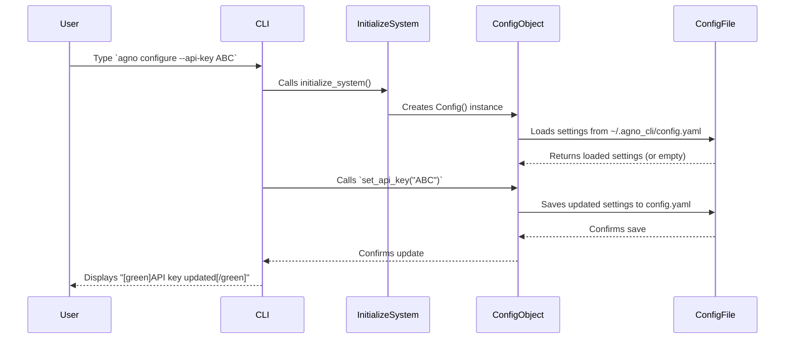

# Chapter 2: CLI Configuration

In [Chapter 1: User Command Interface](01_user_command_interface_.md), you learned how to command your `agno-cli` spaceship using simple text commands. You could tell it to chat, list agents, or search the web. But what if you always want your AI to use a specific model, like OpenAI's latest, instead of the default? Or what if you need to tell `agno-cli` your secret API key so it can connect to those powerful AI services?

This is where **CLI Configuration** comes in! Think of it as your `agno-cli`'s "settings panel." It stores all your personal preferences and important details, like which AI model to use, your secret API keys, and even how chat history is saved. It makes sure `agno-cli` behaves exactly as you prefer, remembering your choices even after you close your terminal.

## What is CLI Configuration?

At its core, CLI Configuration is about making `agno-cli` work just for *you*. It's a way to customize its behavior without having to type long options every single time you run a command.

It solves a common problem: how does a command-line tool remember your preferences? Instead of forcing you to set up API keys or preferred models repeatedly, `agno-cli` uses a special configuration file to store these settings.

Here's what it primarily does:

*   **Remembers Your Choices**: It saves your preferred AI model (like GPT-4o or Claude), API keys, and other operational settings.
*   **Customizes Behavior**: You can enable debug modes, change how chat history is handled, or specify where `agno-cli` saves its files.
*   **Ensures Consistency**: Once set, `agno-cli` will consistently use your chosen settings across all your commands and sessions.

## Your Agno CLI Settings Panel: The `config.yaml` File

`agno-cli` stores all its settings in a simple, human-readable file called `config.yaml`. This file is typically located in a special folder that `agno-cli` creates for itself: `~/.agno_cli/config.yaml`. The `~` symbol is a shortcut for your home directory, meaning it's easily accessible but keeps your settings separate from other files.

This file is organized into different sections, or categories, for different types of settings:

*   **`model` settings**: Control which AI provider and model `agno-cli` uses, and related details like API keys, temperature (how creative the AI is), and max tokens (how long its responses can be).
*   **`agent` settings**: Define the default behavior for newly created agents, such as their name, role, and initial instructions.
*   **`cli` settings**: Manage how `agno-cli` itself behaves, like enabling debug mode or where it stores session data and logs.

## Use Case: Setting Up Your AI Model and API Key

Let's walk through a common and important use case: telling `agno-cli` which AI model to use and providing it with the necessary API key.

### Step 1: See Your Current Configuration

Before changing anything, it's good to see what `agno-cli` is currently set to. You can use the `configure` command with the `--show` option:

```bash
agno configure --show
```

**What you'll see:** The User Command Interface will display a nicely formatted panel showing your current AI model settings, directory paths, and whether an API key is currently detected.

```
┌─────────────────────────── Configuration ───────────────────────────┐
│                                                                     │
│ **Current Configuration**                                           │
│                                                                     │
│ **Model Provider:** anthropic                                       │
│ **Model ID:** claude-sonnet-4-20250514                              │
│ **Temperature:** 0.7                                                │
│ **Max Tokens:** 32000                                               │
│ **API Key Set:** No                                                 │
│                                                                     │
│ **Directories:**                                                    │
│ - Config: /Users/youruser/.agno_cli                                 │
│ - Sessions: /Users/youruser/.agno_cli/sessions                      │
│ - Logs: /Users/youruser/.agno_cli/logs                              │
│                                                                     │
└─────────────────────────────────────────────────────────────────────┘
```

### Step 2: Set Your API Key

API keys are like passwords that let `agno-cli` access powerful AI services from companies like OpenAI or Anthropic. It's crucial to keep them secret!

You can set your API key using the `--api-key` option:

```bash
agno configure --api-key YOUR_ACTUAL_OPENAI_OR_ANTHROPIC_API_KEY_HERE
```

Replace `YOUR_ACTUAL_OPENAI_OR_ANTHROPIC_API_KEY_HERE` with your real API key.

**What you'll see:**
```bash
[green]API key updated[/green]
```
`agno-cli` will confirm that the API key has been saved.

**Important Note on API Keys:** `agno-cli` first checks its `config.yaml` file for an API key. If it doesn't find one there, it will then look for it in your system's "environment variables" (like `ANTHROPIC_API_KEY` or `OPENAI_API_KEY`). Storing API keys in environment variables is often considered more secure, especially if you share your `config.yaml` file or commit it to version control.

### Step 3: Change Your Default AI Model

Now, let's say you want `agno-cli` to use a different AI model by default, for example, OpenAI's `gpt-4o`. You can change both the `provider` and the `model` ID:

```bash
agno configure --provider openai --model gpt-4o
```

**What you'll see:**
```bash
[green]Set provider to openai[/green]
[green]Set model to gpt-4o[/green]
```
`agno-cli` will confirm these changes. From now on, whenever you start a new chat or task, `agno-cli` will try to use `gpt-4o` from OpenAI, unless you specify a different model directly in your command.

You can also set other options like debug mode:

```bash
agno configure --set cli.debug=true
```

This command tells `agno-cli` to enable debug mode (which might show more technical output). Notice how `cli.debug` uses a "dot" to refer to a setting *inside* the `cli` section of the configuration.

## Behind the Scenes: How Configuration Works

When you type `agno configure --show` or `agno configure --api-key ...`, what exactly happens inside `agno-cli`?

1.  **Command Intercepted**: The [User Command Interface](01_user_command_interface_.md) (specifically the `typer` part) recognizes the `configure` command and its options.
2.  **System Initialization**: Before any `agno-cli` command runs, a special function called `initialize_system()` is called. This function creates (or loads) the `Config` object, which is responsible for managing all settings.
3.  **Loading Settings**: The `Config` object immediately tries to find and load settings from your `~/.agno_cli/config.yaml` file. If the file doesn't exist, it starts with default settings.
4.  **Applying Changes**:
    *   For `--show`, the `configure` command simply asks the `Config` object for its current settings and displays them.
    *   For `--api-key`, the `configure` command tells the `Config` object to update its API key.
    *   For `--model` or `--provider`, it tells the `Config` object to update the model settings.
5.  **Saving Settings**: If any settings are changed (like an API key or model ID), the `Config` object automatically saves these new settings back to the `~/.agno_cli/config.yaml` file. This is how `agno-cli` "remembers" your choices!

Here's a simple diagram to visualize this flow:



## A Glimpse at the Code

Let's peek at how this is set up in the `agno-cli` code. Don't worry about understanding every line; the goal is just to see how these concepts connect to real programming.

The core of the configuration management lives in `agno_cli/core/config.py`. Here, you'll find classes that represent your settings, and the `Config` class that handles loading and saving them.

```python
# File: agno_cli/core/config.py

from pathlib import Path
from dataclasses import dataclass, asdict
import yaml # For reading/writing YAML files

@dataclass
class ModelConfig:
    """Model configuration"""
    provider: str = "anthropic"
    model_id: str = "claude-sonnet-4-20250514"
    api_key: str = None # Important for API keys

@dataclass
class CLIConfig:
    """CLI configuration"""
    debug: bool = False
    session_dir: str = "~/.agno_cli/sessions"
    # ... more cli settings ...

class Config:
    """Configuration manager for Agno CLI SDK"""
    
    def __init__(self, config_path: str = None):
        self.config_path = Path(config_path or "~/.agno_cli/config.yaml").expanduser()
        self.config_dir = self.config_path.parent
        self.config_dir.mkdir(parents=True, exist_ok=True) # Ensure folder exists
        
        self.model = ModelConfig() # Default model settings
        self.cli = CLIConfig()     # Default CLI settings
        
        self.load() # Load existing configuration when created
    
    def load(self) -> None:
        """Load configuration from file"""
        if self.config_path.exists():
            with open(self.config_path, 'r') as f:
                data = yaml.safe_load(f) or {}
            if 'model' in data:
                self.model = ModelConfig(**data['model'])
            if 'cli' in data:
                self.cli = CLIConfig(**data['cli'])
    
    def save(self) -> None:
        """Save configuration to file"""
        data = {
            'model': asdict(self.model),
            'cli': asdict(self.cli)
        }
        with open(self.config_path, 'w') as f:
            yaml.dump(data, f, default_flow_style=False, indent=2)
            
    def set_api_key(self, api_key: str, provider: str = None) -> None:
        """Set API key for the specified provider"""
        self.model.provider = provider or self.model.provider # Set provider if given
        self.model.api_key = api_key
        self.save() # Always save after changing
    
    def update_model_config(self, **kwargs) -> None:
        """Update model configuration"""
        for key, value in kwargs.items():
            if hasattr(self.model, key):
                setattr(self.model, key, value)
        self.save()
```
This `Config` class is like the manager for your settings. When `agno-cli` starts, it creates an instance of `Config`. This instance then tries to `load()` your preferences from the `config.yaml` file. When you use a command like `agno configure --api-key`, the `set_api_key` method (or `update_model_config`) is called, which updates the settings and then `save()`s them back to the file.

Now, let's look at how the `agno configure` command in `agno_cli/cli.py` interacts with this `Config` class:

```python
# File: agno_cli/cli.py

import typer
from rich.console import Console
from rich.panel import Panel
from rich.markdown import Markdown

from core.config import Config # Import our Config manager

app = typer.Typer(...) # Our main CLI app

console = Console()
config = None # This will hold our Config object

def initialize_system():
    """Initialize the multi-agent system and tools"""
    global config # We want to modify the global 'config' variable
    if config is None:
        config = Config() # Create the Config object, which loads settings

@app.command()
def configure(
    show: bool = typer.Option(False, "--show", help="Show current configuration"),
    provider: Optional[str] = typer.Option(None, "--provider", help="Set model provider"),
    model: Optional[str] = typer.Option(None, "--model", help="Set model ID"),
    api_key: Optional[str] = typer.Option(None, "--api-key", help="Set API key"),
    # ... other options ...
):
    """Configure the Agno CLI settings"""
    initialize_system() # Make sure our config object is ready!
    
    if show:
        config_text = f"""
**Current Configuration**

**Model Provider:** {config.model.provider}
**Model ID:** {config.model.model_id}
# ... (rest of the display text) ...
"""
        panel = Panel(Markdown(config_text), title="Configuration", border_style="blue")
        console.print(panel)
    
    elif provider:
        config.model.provider = provider # Directly update the provider in the model settings
        config.save() # Save the change
        console.print(f"[green]Set provider to {provider}[/green]")
    
    elif model:
        config.model.model_id = model # Directly update the model ID
        config.save() # Save the change
        console.print(f"[green]Set model to {model}[/green]")
    
    elif api_key:
        config.set_api_key(api_key) # Use the special method to set and save API key
        console.print("[green]API key updated[/green]")
    # ... (other 'elif' blocks for other configure options) ...

```
This snippet from `cli.py` shows how the `configure` command uses the `Config` object. When you run `agno configure`, `initialize_system()` ensures the `config` object is created and ready. Then, depending on your options (like `--show`, `--provider`, `--api-key`), it either reads from `config.model` (to display) or calls methods like `config.set_api_key()` to update and save your settings.

## Why Use CLI Configuration?

You might wonder why `agno-cli` uses a configuration file and dedicated commands instead of just requiring you to type options every time. Here's why it's powerful:

| Feature      | CLI Configuration                      | Repeating CLI Options (`--model`, `--api-key` every time) |
| :----------- | :------------------------------------- | :-------------------------------------------------------- |
| **Convenience**| Set once, use everywhere             | Must type every time you run a command                   |
| **Persistence**| Settings remembered even after closing terminal | Settings are lost when the command finishes           |
| **Consistency**| All `agno` commands use the same defaults | Easy to accidentally use different settings            |
| **Automation** | Ideal for scripts and automated tasks | Requires adding options to every script line              |
| **Security**   | Can manage API keys (e.g., check environment variables) | API keys might be exposed in command history           |

For managing a versatile AI system like `agno-cli`, having a robust configuration system allows for a highly personalized and efficient workflow.

## Conclusion

You've now explored the "settings panel" of `agno-cli`: the CLI Configuration. You understand that it allows you to customize your multi-agent AI system, remembering preferences like your AI model and API keys in a dedicated `config.yaml` file. You've also seen how simple it is to view and change these settings using the `agno configure` command, and gained insight into how `agno-cli` loads and saves these preferences behind the scenes.

With your command interface ready and your settings customized, you're now fully equipped to dive into the heart of `agno-cli`: the AI brain itself. In the next chapter, we'll peel back another layer and discover the [Agent System Core](03_agent_system_core_.md), which is where the AI agents live and perform their magic!

---

<sub><sup>Powered by  [agno-cli](https://github.com/paulgg-code/agno-cli).</sup></sub> <sub><sup>**References**: [[1]](https://github.com/paulgg-code/agno-cli/blob/224671768634650c331417cb4eb63e65003c7507/agno_cli/cli.py), [[2]](https://github.com/paulgg-code/agno-cli/blob/224671768634650c331417cb4eb63e65003c7507/agno_cli/core/config.py)</sup></sub>