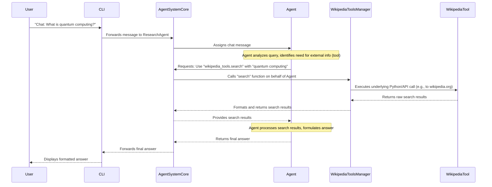

# Chapter 6: AI Tool Ecosystem

In [Chapter 5: Chat Session Management](05_chat_session_management_.md), you learned how `agno-cli` keeps track of your conversations, allowing for continuous and context-aware dialogues with your AI agents. You can now chat seamlessly, and your agents remember what you discussed. But what if your AI agents need to *do* more than just talk?

Imagine your highly specialized AI agents are like a team of expert workers, each with unique skills. A "ResearchAgent" needs to search the internet, a "DataAnalyst" needs to crunch numbers, and a "CodeAssistant" needs to manage files or even build web applications. Just like a human worker uses various physical and digital tools (a calculator, a web browser, a file manager, a microscope), your AI agents also need access to specialized functionalities to interact with the real world.

This is precisely what the `agno-cli` **AI Tool Ecosystem** provides! It's the vast collection of external functionalities and specialized modules that your AI agents can "use" to perform practical actions beyond just generating text. It transforms your talking AI into a doing AI.

## What is the AI Tool Ecosystem?

At its core, the AI Tool Ecosystem is the bridge between your AI agents' "thinking" and "talking" abilities, and their capacity to **act in the real world**. It's not about the AI *simulating* an action, but about `agno-cli` *executing* a real-world operation on behalf of the AI.

It solves a fundamental problem: how do AI models, which are essentially advanced text processors, interact with and influence the world outside their digital brains? The solution is to equip them with "tools" – pre-defined functions or modules that perform specific tasks.

Here's what it primarily does:

*   **Provides Real-World Interaction**: Enables AI agents to perform actions like searching the internet, reading/writing files, querying databases, creating charts, analyzing financial data, and more.
*   **Encourages Specialization**: Different tools allow different agents to specialize. A `ResearchAgent` might use web search tools, while a `FinancialAnalyst` might use stock market data tools.
*   **Extends Capabilities**: Without tools, an AI is limited to its training data. With tools, it can access up-to-the-minute information and perform dynamic actions.
*   **Modular and Expandable**: New tools can be added easily, expanding the AI system's overall capabilities without modifying the core AI logic.

## Key Concepts of the AI Tool Ecosystem

Let's break down the core ideas behind this powerful system:

### 1. Tools: The AI's Specialized Equipment

In `agno-cli`, a "tool" is a specific function or module designed to perform a focused task. Think of them as individual applications on your smartphone:

*   **`wikipedia_tools`**: For searching and retrieving information from Wikipedia.
*   **`file_system_tools`**: For interacting with local files and directories (read, write, list).
*   **`financial_tools`**: For fetching stock prices, historical data, and financial news.
*   **`shell_tools`**: For running basic command-line operations on your computer.
*   **`streamlit_tools`**: For autonomously building and deploying web applications.
*   ...and many more, like `opencv_tools` (image processing), `sql_tools` (database queries), `openai_tools` (direct OpenAI API calls for image generation, transcription, etc.), and `thinking_tools` (structured reasoning).

Each tool is designed to be highly reliable and predictable.

### 2. Tool Managers: Organizing the Toolbox

Instead of having individual tools floating around, they are organized into "Tool Managers." A `WikipediaToolsManager` might handle all Wikipedia-related functions (`search`, `get_article`, `get_summary`). This helps keep the ecosystem organized and provides a unified interface for agents to call them.

### 3. Capabilities: Matching Tools to Agents

As you learned in [Chapter 3: Agent System Core](03_agent_system_core_.md), each AI agent has "capabilities." These capabilities explicitly list which tools and skills an agent possesses. For example, a `ResearchAgent` might have `wikipedia_tools` and `duckduckgo_tools` in its capabilities, allowing the [Task Orchestrator](04_task_orchestrator_.md) or the agent itself to know it can use these tools.

## Using Agno CLI Tools: Practical Examples

Let's see how easy it is to make your agents use these powerful tools. Even though agents will use them autonomously, you can often call these tools directly through `agno-cli` commands.

### Use Case 1: Searching Wikipedia

Imagine you want your `ResearchAgent` (or any agent that can use `wikipedia_tools`) to find information about "artificial intelligence."

```bash
agno wikipedia --search "Artificial Intelligence" --limit 3
```

**What you'll see:** The `agno-cli` will display a table summarizing the top search results from Wikipedia, including titles, short snippets, and URLs.

```
┌────────────────────────── Wikipedia Search Results for 'Artificial Intelligence' ───────────────────────────┐
│ Title                    │ Snippet                                 │ Word Count │ Categories           │ URL          │
├──────────────────────────┼─────────────────────────────────────────┼────────────┼──────────────────────┼──────────────┤
│ Artificial intelligence  │ Artificial intelligence (AI) is the in… │ 24195      │ Artificial intell…   │ https://en…  │
│ AI winter                │ An AI winter is a period of reduced …   │ 1675       │ Artificial intell…   │ https://en…  │
│ History of artificial …  │ The history of artificial intelligenc…  │ 10237      │ Artificial intell…   │ https://en…  │
└──────────────────────────┴─────────────────────────────────────────┴────────────┴──────────────────────┴──────────────┘
```

### Use Case 2: Inspecting Your Files

Suppose your `CodeAssistant` needs to check the contents of a directory. You can use the `file_system_tools`.

```bash
agno files --list --path . --tree
```

**What you'll see:** `agno-cli` will display a neatly formatted tree structure of the current directory, showing files and sub-folders.

```
┌──────────────────────────────────────── Directory Tree: . ──────────────────────────────────────────┐
│ 📁 .                                                                                                │
│ ├── 📁 .agno_cli                                                                                      │
│ │   ├── 📄 config.yaml                                                                               │
│ │   ├── 📁 sessions                                                                                   │
│ │   │   ├── 📁 5a7b8c9d-0e1f-2345-6789-0abcde1f2g3h                                                   │
│ │   │   │   └── 📄 messages.json                                                                      │
│ │   │   └── 📄 sessions.json                                                                         │
│ │   └── 📄 system_state.json                                                                         │
│ ├── 📄 README.md                                                                                      │
│ └── 📄 app.py                                                                                        │
└───────────────────────────────────────────────────────────────────────────────────────────────────────┘
```

### Use Case 3: Getting Real-time Financial Data

Your `FinancialAnalyst` might need to check the current stock price of NVIDIA.

```bash
agno finance --symbol NVDA --action info
```

**What you'll see:** A detailed panel with real-time stock information.

```
┌───────────────────────────── Stock Information: NVDA ───────────────────────────────┐
│ **NVIDIA Corporation (NVDA)**                                                       │
│                                                                                     │
│ **Price:** $120.50                                                                  │
│ **Change:** $2.10 (1.77%)                                                           │
│ **Volume:** 45,678,901                                                              │
│ **Market Cap:** $2,987,654,321,000                                                  │
│ **P/E Ratio:** 65.23                                                                │
│ **52W High:** $130.00                                                               │
│ **52W Low:** $40.00                                                                 │
└─────────────────────────────────────────────────────────────────────────────────────┘
```

These examples show how `agno-cli` provides direct access to these tools, but remember, the real power comes when your AI agents *autonomously* decide which tools to use and when!

## Behind the Scenes: How Tools are Used by AI Agents

When an AI agent needs to perform an action, it's not simply "thinking" about it. It's making a conscious decision to invoke one of its available tools. Let's trace how this happens when an agent, perhaps a `ResearchAgent`, decides it needs to search Wikipedia for an answer to your question.

1.  **User Request**: You ask your `ResearchAgent` (via `agno chat`) a question like "What is quantum computing and what are its main applications?"
2.  **Agent Receives Request**: The `ResearchAgent` (part of the [Agent System Core](03_agent_system_core_.md)) receives your message. Its internal AI brain realizes it needs external information to answer accurately.
3.  **Agent Chooses Tool**: Based on its `capabilities` (which include `wikipedia_tools` and `duckduckgo_tools`), its training, and the nature of the question, the agent determines that a web search tool is appropriate. It formulates a "tool call" – essentially a structured instruction to use a specific tool with specific parameters (e.g., call `wikipedia_tools.search` with the query "quantum computing applications").
4.  **Tool Call to Orchestrator**: The agent sends this "tool call" request to the [Task Orchestrator](04_task_orchestrator_.md) (which is part of the `MultiAgentSystem`).
5.  **Orchestrator Executes Tool**: The `Task Orchestrator` acts as the middleman. It receives the tool call, verifies it, and then dispatches the request to the appropriate Tool Manager (e.g., `WikipediaToolsManager`).
6.  **Tool Manager Runs Tool**: The `WikipediaToolsManager` receives the `search` request and internally uses the Python `wikipedia` library (or an API call) to perform the actual search.
7.  **Real-World Interaction**: The `wikipedia` library sends a request to Wikipedia's servers, gets the data, and processes it.
8.  **Result Back to Tool Manager**: The `WikipediaToolsManager` receives the search results.
9.  **Result Back to Agent**: The `WikipediaToolsManager` formats the results neatly and sends them back through the `Task Orchestrator` to the original `ResearchAgent`.
10. **Agent Processes Result**: The `ResearchAgent` now has the factual information. It integrates this into its knowledge, processes it, and formulates a comprehensive answer for you.
11. **Agent Responds to User**: The agent sends its final answer back to the [User Command Interface](01_user_command_interface_.md), which displays it in your terminal.

Here’s a simplified sequence diagram:



## A Glimpse at the Code

Let's peek at how this is set up in the `agno-cli` code. Don't worry about understanding every line; the goal is just to see how these concepts connect to real programming.

### 1. Initializing Tools in `agno_cli/cli.py`

When `agno-cli` starts, a central `initialize_system()` function is called (as seen in previous chapters). This function is responsible for setting up all the necessary components, including the tool managers.

```python
# File: agno_cli/cli.py
# ... (imports) ...
from tools.wikipedia_tools import WikipediaToolsManager
from tools.file_system_tools import FileSystemToolsManager
from tools.financial_tools import FinancialToolsManager
# ... (many other tool imports) ...

# Global instances (initially None)
# ...
wikipedia_tools = None
file_system_tools = None
financial_tools = None
# ... (other global tool instances) ...

def initialize_system():
    """Initialize the multi-agent system and tools"""
    global wikipedia_tools, file_system_tools, financial_tools # ... (and all other tools) ...
    global config, session_manager, multi_agent_system, tracer, metrics, chat_commands, team_commands # ...
    
    # ... (code to initialize config, session_manager, multi_agent_system, etc.) ...
    
    if multi_agent_system is not None: # Ensure basic system is ready
        # Initialize tool managers
        wikipedia_tools = WikipediaToolsManager()
        file_system_tools = FileSystemToolsManager()
        financial_tools = FinancialToolsManager({})
        # ... (other tool managers are initialized here) ...
```
This snippet from `cli.py` shows that each `ToolManager` (like `WikipediaToolsManager`) is created once when the system starts up. These managers then become globally accessible, ready to be called by specific `agno-cli` commands or by the AI agents themselves.

### 2. A Tool Command in `agno_cli/cli.py`

Now, let's look at how a CLI command like `agno wikipedia --search` actually uses the `WikipediaToolsManager` that was just initialized.

```python
# File: agno_cli/cli.py

# ... (imports and global initializations) ...

@app.command()
def wikipedia(
    search: Optional[str] = typer.Option(None, "--search", "-s", help="Search Wikipedia articles"),
    limit: int = typer.Option(10, "--limit", "-l", help="Number of results to return"),
    # ... (other options) ...
):
    """Wikipedia research and knowledge retrieval with rich features"""
    initialize_system() # Ensures tools are ready!
    
    try:
        if search:
            # Here's where the tool manager is directly called!
            wikipedia_tools.search(search, limit, format)
        # ... (other elif blocks for other wikipedia commands like --article, --summary) ...
    
    except Exception as e:
        console.print(f"[red]Wikipedia operation error: {e}[/red]")
```
This shows the direct link: when you type `agno wikipedia --search "..."`, the `wikipedia` function within `cli.py` gets activated. It then calls `initialize_system()` to ensure `wikipedia_tools` is set up, and finally uses `wikipedia_tools.search()` to perform the actual search.

### 3. Inside a Tool Manager: `agno_cli/tools/wikipedia_tools.py`

The `WikipediaToolsManager` is responsible for presenting a user-friendly interface to the `wikipedia_tools` backend and formatting the output. Let's look at a simplified version of `WikipediaToolsManager` and its core `WikipediaTools` class.

```python
# File: agno_cli/tools/wikipedia_tools.py

import wikipedia # The actual library that talks to Wikipedia
from rich.console import Console
from rich.table import Table # For nice CLI output

class WikipediaTools:
    """Core Wikipedia research tools (internal logic)"""
    def __init__(self, language: str = "en"):
        wikipedia.set_lang(language) # Set language for Wikipedia searches
        # ... (internal caching setup) ...
    
    def search(self, query: str, limit: int = 10, suggestion: bool = True) -> list:
        """
        Search Wikipedia articles. This is the method the AI agent calls!
        It uses the external 'wikipedia' library.
        """
        try:
            raw_results = wikipedia.search(query, results=limit, suggestion=suggestion)
            
            formatted_results = []
            for result_title in raw_results:
                try:
                    page = wikipedia.page(result_title, auto_suggest=False)
                    # Create a simplified result structure
                    formatted_results.append({
                        "title": page.title,
                        "url": page.url,
                        "snippet": page.summary[:200] + "..." # Truncate for brevity
                    })
                except (wikipedia.exceptions.PageError, wikipedia.exceptions.DisambiguationError):
                    continue # Skip problematic pages
            return formatted_results
        except Exception as e:
            raise Exception(f"Wikipedia search failed: {str(e)}")

class WikipediaToolsManager:
    """CLI integration for Wikipedia tools (what the 'agno wikipedia' command uses)"""
    def __init__(self, language: str = "en"):
        self.wikipedia_tools = WikipediaTools(language) # This manager holds the core tool
        self.console = Console() # For rich formatting
    
    def search(self, query: str, limit: int = 10, format: str = "table"):
        """
        This is the method called by the 'agno wikipedia --search' command.
        It calls the core tool and then formats the output.
        """
        try:
            # Call the actual core tool to get results
            results = self.wikipedia_tools.search(query, limit)
            
            if format == "table":
                table = Table(title=f"Wikipedia Search Results for '{query}'")
                table.add_column("Title", style="cyan")
                table.add_column("Snippet", style="white")
                table.add_column("URL", style="blue")
                
                for result in results:
                    table.add_row(result["title"], result["snippet"], result["url"])
                self.console.print(table)
            # ... (else if for 'json' format) ...
        except Exception as e:
            self.console.print(f"[red]Search error: {e}[/red]")
```
This snippet shows the hierarchy: `WikipediaTools` contains the logic to interact with the external Wikipedia library. `WikipediaToolsManager` wraps `WikipediaTools` to handle CLI-specific concerns like progress indicators and formatting, making it user-friendly. When an AI agent makes a `wikipedia_tools.search` call, it's actually interacting with this underlying `WikipediaTools` class.

## Why an AI Tool Ecosystem?

Without a robust AI Tool Ecosystem, your AI agents would be confined to their initial training data, unable to perform up-to-date research, manage files, or interact with real-world services. Here's why this concept is fundamental for `agno-cli`:

| Feature                      | With AI Tool Ecosystem (`agno-cli`)                                 | Without AI Tool Ecosystem (Limited AI)                                  |
| :--------------------------- | :------------------------------------------------------------------ | :------------------------------------------------------------------------ |
| **Real-World Interaction**   | Agents can perform actions (search, file ops, API calls).            | Agents only generate text; cannot directly affect external systems.       |
| **Knowledge Currency**       | Accesses up-to-date information (web search, live data).            | Limited to knowledge from training data (can become outdated).            |
| **Task Automation**          | Enables complex multi-step tasks (e.g., "analyze market trends").   | Requires manual human intervention for external steps.                    |
| **Specialization**           | Different agents can master different toolsets.                     | All agents have generic capabilities, less efficient for specific tasks.  |
| **Extensibility**            | Easy to add new tools to expand capabilities.                       | Requires retraining or re-engineering the core AI for new abilities.      |
| **Reliability**              | Tools execute deterministic, error-handled operations.              | AI might "hallucinate" how an action works rather than executing it.     |

The AI Tool Ecosystem transforms your `agno-cli` from a conversational interface into a powerful, action-oriented, and highly adaptable multi-agent system.

## Conclusion

You've now uncovered the crucial role of the **AI Tool Ecosystem** in `agno-cli`. You understand that it's the bridge that allows your intelligent AI agents to interact with the real world, performing concrete actions like searching the web, managing files, and fetching live data. You've seen examples of how `agno-cli` exposes these powerful tools directly through simple commands, and gained insight into how agents leverage their "capabilities" to select and use the right tool for the job.

With all components now explored – from the user interface and configuration to the agent core, task orchestrator, chat management, and the vast tool ecosystem – you now have a complete picture of how `agno-cli` empowers you to command a sophisticated, efficient, and versatile multi-agent AI system. You are now fully equipped to explore the full potential of `agno-cli` and build powerful AI-driven solutions!

---

<sub><sup>Powered by [agno-cli](https://github.com/paulgg-code/agno-cli).</sup></sub> <sub><sup>**References**: [[1]](https://github.com/paulgg-code/agno-cli/blob/224671768634650c331417cb4eb63e65003c7507/agno_cli/cli.py), [[2]](https://github.com/paulgg-code/agno-cli/blob/224671768634650c331417cb4eb63e65003c7507/agno_cli/tools/__init__.py), [[3]](https://github.com/paulgg-code/agno-cli/blob/224671768634650c331417cb4eb63e65003c7507/agno_cli/tools/arxiv_tools.py), [[4]](https://github.com/paulgg-code/agno-cli/blob/224671768634650c331417cb4eb63e65003c7507/agno_cli/tools/crawl4ai_tools.py), [[5]](https://github.com/paulgg-code/agno-cli/blob/224671768634650c331417cb4eb63e65003c7507/agno_cli/tools/csv_tools.py), [[6]](https://github.com/paulgg-code/agno-cli/blob/224671768634650c331417cb4eb63e65003c7507/agno_cli/tools/docker_tools.py), [[7]](https://github.com/paulgg-code/agno-cli/blob/224671768634650c331417cb4eb63e65003c7507/agno_cli/tools/duckdb_tools.py), [[8]](https://github.com/paulgg-code/agno-cli/blob/224671768634650c331417cb4eb63e65003c7507/agno_cli/tools/file_system_tools.py), [[9]](https://github.com/paulgg-code/agno-cli/blob/224671768634650c331417cb4eb63e65003c7507/agno_cli/tools/financial_tools.py), [[10]](https://github.com/paulgg-code/agno-cli/blob/224671768634650c331417cb4eb63e65003c7507/agno_cli/tools/function_tools.py), [[11]](https://github.com/paulgg-code/agno-cli/blob/224671768634650c331417cb4eb63e65003c7507/agno_cli/tools/hackernews_tools.py), [[12]](https://github.com/paulgg-code/agno-cli/blob/224671768634650c331417cb4eb63e65003c7507/agno_cli/tools/math_tools.py), [[13]](https://github.com/paulgg-code/agno-cli/blob/224671768634650c331417cb4eb63e65003c7507/agno_cli/tools/models_tools.py), [[14]](https://github.com/paulgg-code/agno-cli/blob/224671768634650c331417cb4eb63e65003c7507/agno_cli/tools/openai_tools.py), [[15]](https://github.com/paulgg-code/agno-cli/blob/224671768634650c331417cb4eb63e65003c7507/agno_cli/tools/opencv_tools.py), [[16]](https://github.com/paulgg-code/agno-cli/blob/224671768634650c331417cb4eb63e65003c7507/agno_cli/tools/pandas_tools.py), [[17]](https://github.com/paulgg-code/agno-cli/blob/224671768634650c331417cb4eb63e65003c7507/agno_cli/tools/postgres_tools.py), [[18]](https://github.com/paulgg-code/agno-cli/blob/224671768634650c331417cb4eb63e65003c7507/agno_cli/tools/pubmed_tools.py), [[19]](https://github.com/paulgg-code/agno-cli/blob/224671768634650c331417cb4eb63e65003c7507/agno_cli/tools/screenshot_tools.py), [[20]](https://github.com/paulgg-code/agno-cli/blob/224671768634650c331417cb4eb63e65003c7507/agno_cli/tools/search_tools.py), [[21]](https://github.com/paulgg-code/agno-cli/blob/224671768634650c331417cb4eb63e65003c7507/agno_cli/tools/shell_tools.py), [[22]](https://github.com/paulgg-code/agno-cli/blob/224671768634650c331417cb4eb63e65003c7507/agno_cli/tools/sleep_tools.py), [[23]](https://github.com/paulgg-code/agno-cli/blob/224671768634650c331417cb4eb63e65003c7507/agno_cli/tools/sql_tools.py), [[24]](https://github.com/paulgg-code/agno-cli/blob/224671768634650c331417cb4eb63e65003c7507/agno_cli/tools/streamlit_prompts.py), [[25]](https://github.com/paulgg-code/agno-cli/blob/224671768634650c331417cb4eb63e65003c7507/agno_cli/tools/streamlit_tools.py), [[26]](https://github.com/paulgg-code/agno-cli/blob/224671768634650c331417cb4eb63e65003c7507/agno_cli/tools/thinking_tools.py), [[27]](https://github.com/paulgg-code/agno-cli/blob/224671768634650c331417cb4eb63e65003c7507/agno_cli/tools/visualization_tools.py), [[28]](https://github.com/paulgg-code/agno-cli/blob/224671768634650c331417cb4eb63e65003c7507/agno_cli/tools/wikipedia_tools.py)</sup></sub>